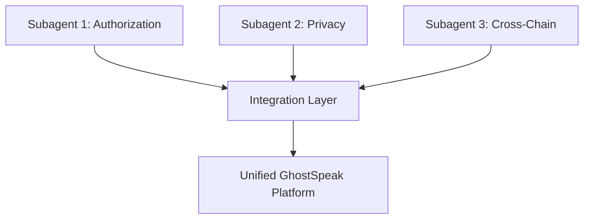

# GhostSpeak Q2 2026: Competitive Feature Implementation Plan

## 🎯 Objective
Implement three critical features to achieve competitive parity with ERC-8004 and SingularityNET:
1. **Agent Authorization** (ERC-8004 parity)
2. **Privacy Controls** (W3C VC 2.0 compliance)
3. **Cross-Chain Credential Issuance** (Multi-chain support)

## 📊 Subagent Architecture



---

## 🤖 SUBAGENT 1: Agent Authorization System

### **Mission**
Implement ERC-8004-compliant agent authorization mechanism allowing agents to pre-authorize reputation updates with cryptographic signatures.

### **Research Phase Deliverables**
1. ✅ **ERC-8004 Authorization Spec**: Complete signature format and verification process
2. ✅ **Solana Ed25519 Verification**: Native program integration patterns
3. ✅ **PayAI Integration**: How facilitators submit authorized feedback

### **Implementation Scope**

#### **Phase 1: Core Authorization Types (Week 1)**

**Files to Create:**
- `packages/sdk-typescript/src/types/authorization-types.ts`
- `packages/sdk-typescript/src/utils/signature-verification.ts`
- `programs/src/state/authorization.rs`
- `programs/src/instructions/authorize_reputation.rs`

**Key Types:**
```typescript
// ERC-8004 inspired, Solana adapted
export interface ReputationAuthorization {
  agentAddress: Address          // Agent's public key
  authorizedSource: Address      // PayAI facilitator or other source
  indexLimit: number             // Max number of updates allowed
  expiresAt: number              // Unix timestamp
  network: 'mainnet' | 'devnet'  // Solana network
  signature: Uint8Array          // Ed25519 signature (64 bytes)
}

export interface AuthorizationProof {
  authorization: ReputationAuthorization
  currentIndex: number           // Current update count
  isValid: boolean
  verifiedAt: number
}
```

**Signature Message Format:**
```typescript
// EIP-191 inspired for Solana
const message = Buffer.concat([
  Buffer.from('GhostSpeak Reputation Authorization'),
  agentAddress.toBuffer(),
  authorizedSource.toBuffer(),
  Buffer.from(indexLimit.toString()),
  Buffer.from(expiresAt.toString()),
  Buffer.from(network)
])
```

#### **Phase 2: On-Chain Verification (Week 2)**

**Rust Smart Contract:**
```rust
// programs/src/state/authorization.rs
#[account]
pub struct ReputationAuthorizationAccount {
    pub agent: Pubkey,
    pub authorized_source: Pubkey,
    pub index_limit: u64,
    pub current_index: u64,
    pub expires_at: i64,
    pub signature: [u8; 64],
    pub bump: u8,
}

// programs/src/instructions/authorize_reputation.rs
pub fn authorize_reputation_updates(
    ctx: Context<AuthorizeReputation>,
    index_limit: u64,
    expires_at: i64,
    signature: [u8; 64],
) -> Result<()> {
    // Verify Ed25519 signature using native program
    // Store authorization on-chain
    // Emit event
}

pub fn verify_and_update_reputation(
    ctx: Context<UpdateReputation>,
    reputation_change: i64,
) -> Result<()> {
    let auth = &mut ctx.accounts.authorization;

    // Check expiration
    require!(
        Clock::get()?.unix_timestamp < auth.expires_at,
        ErrorCode::AuthorizationExpired
    );

    // Check index limit
    require!(
        auth.current_index < auth.index_limit,
        ErrorCode::IndexLimitExceeded
    );

    // Increment index
    auth.current_index += 1;

    // Update reputation...
}
```

#### **Phase 3: SDK Integration (Week 3)**

**TypeScript SDK:**
```typescript
// packages/sdk-typescript/src/modules/authorization/AuthorizationModule.ts
export class AuthorizationModule {

  /**
   * Agent creates authorization for a reputation source
   */
  async authorizeReputationSource(params: {
    agentKeypair: Keypair           // Agent's private key
    authorizedSource: Address        // PayAI facilitator
    indexLimit: number               // Max updates (e.g., 1000)
    expiresAt: number                // Unix timestamp
  }): Promise<ReputationAuthorization> {

    // 1. Create message to sign
    const message = this.createAuthorizationMessage(params)

    // 2. Sign with Ed25519
    const signature = await this.signMessage(
      message,
      params.agentKeypair
    )

    // 3. Create authorization object
    const authorization: ReputationAuthorization = {
      agentAddress: params.agentKeypair.publicKey,
      authorizedSource: params.authorizedSource,
      indexLimit: params.indexLimit,
      expiresAt: params.expiresAt,
      network: this.cluster,
      signature
    }

    // 4. Store on-chain (optional)
    if (params.storeOnChain) {
      await this.storeAuthorizationOnChain(authorization)
    }

    return authorization
  }

  /**
   * PayAI facilitator verifies authorization before updating reputation
   */
  async verifyAuthorization(
    authorization: ReputationAuthorization,
    currentIndex: number
  ): Promise<AuthorizationProof> {

    // 1. Check expiration
    const now = Math.floor(Date.now() / 1000)
    if (now >= authorization.expiresAt) {
      return { authorization, currentIndex, isValid: false, verifiedAt: now }
    }

    // 2. Check index limit
    if (currentIndex >= authorization.indexLimit) {
      return { authorization, currentIndex, isValid: false, verifiedAt: now }
    }

    // 3. Verify Ed25519 signature
    const message = this.createAuthorizationMessage(authorization)
    const isValidSignature = await this.verifySignature(
      message,
      authorization.signature,
      authorization.agentAddress
    )

    return {
      authorization,
      currentIndex,
      isValid: isValidSignature,
      verifiedAt: now
    }
  }

  private async signMessage(
    message: Uint8Array,
    keypair: Keypair
  ): Promise<Uint8Array> {
    const { sign } = await import('@noble/ed25519')
    return sign(message, keypair.secretKey.slice(0, 32))
  }

  private async verifySignature(
    message: Uint8Array,
    signature: Uint8Array,
    publicKey: Address
  ): Promise<boolean> {
    const { verify } = await import('@noble/ed25519')
    return verify(signature, message, publicKey.toBytes())
  }
}
```

#### **Phase 4: PayAI Webhook Integration (Week 4)**

**Update Webhook Handler:**
```typescript
// packages/web/app/api/payai/webhook/route.ts

// Add authorization verification before reputation update
async function updateReputation(record: PayAIReputationRecord): Promise<void> {

  // 1. Retrieve agent's authorization
  const authorization = await getAgentAuthorization(
    record.agentAddress,
    PAYAI_FACILITATOR_ADDRESS
  )

  // 2. Verify authorization
  if (!authorization) {
    console.warn('[PayAI Webhook] No authorization found for agent:',
      record.agentAddress.toString())
    // Option A: Skip update (strict mode)
    // Option B: Request authorization from agent
    // Option C: Update with "pending" status until authorized
    return
  }

  const proof = await authorizationModule.verifyAuthorization(
    authorization,
    getCurrentIndex(record.agentAddress)
  )

  if (!proof.isValid) {
    throw new Error(`Authorization invalid: expired or index limit exceeded`)
  }

  // 3. Update reputation (existing logic)
  const entry = calculateReputationChange(record)

  // 4. Increment authorization index
  await incrementAuthorizationIndex(record.agentAddress)

  // 5. Issue credentials if tier crossed
  await maybeIssueCredential(record.agentAddress, entry.overallScore)
}
```

### **Testing Strategy**

```typescript
// packages/sdk-typescript/tests/integration/authorization.test.ts
describe('Agent Authorization System', () => {

  it('should create valid authorization', async () => {
    const agent = Keypair.generate()
    const auth = await authModule.authorizeReputationSource({
      agentKeypair: agent,
      authorizedSource: PAYAI_FACILITATOR,
      indexLimit: 100,
      expiresAt: Date.now() / 1000 + 86400 // 24 hours
    })

    expect(auth.signature).toHaveLength(64)
    expect(auth.agentAddress).toBe(agent.publicKey)
  })

  it('should verify valid authorization', async () => {
    const proof = await authModule.verifyAuthorization(auth, 0)
    expect(proof.isValid).toBe(true)
  })

  it('should reject expired authorization', async () => {
    const expiredAuth = { ...auth, expiresAt: Date.now() / 1000 - 1 }
    const proof = await authModule.verifyAuthorization(expiredAuth, 0)
    expect(proof.isValid).toBe(false)
  })

  it('should reject exceeded index limit', async () => {
    const proof = await authModule.verifyAuthorization(auth, 101)
    expect(proof.isValid).toBe(false)
  })
})
```

### **Deliverables**
- [ ] `AuthorizationModule.ts` - SDK for creating/verifying authorizations
- [ ] `authorize_reputation.rs` - Solana program instruction
- [ ] PayAI webhook authorization checks
- [ ] Test suite (unit + integration)
- [ ] Documentation + migration guide

### **Dependencies**
- `@noble/ed25519` - Ed25519 signature library
- Solana Web3.js v2 - Transaction building
- Existing PayAI webhook handler

### **Success Criteria**
✅ Agents can create signed authorizations off-chain
✅ PayAI facilitators verify authorizations before updates
✅ On-chain program enforces index limits and expiration
✅ 100% test coverage for authorization logic
✅ ERC-8004 feature parity achieved

---

## 🔒 SUBAGENT 2: Privacy Controls & Selective Disclosure

### **Mission**
Implement W3C VC 2.0 compliant privacy controls with selective disclosure, allowing agents to share credentials without revealing all data.

### **Research Phase Deliverables**
1. ✅ **W3C VC 2.0 Standard**: Selective disclosure mechanisms (BBS+, JSON-LD)
2. ✅ **BBS+ Signatures**: Zero-knowledge proof cryptosuite
3. ✅ **Crossmint Encryption**: Built-in privacy options

### **Implementation Scope**

#### **Phase 1: Privacy Settings Schema (Week 1)**

**Files to Create:**
- `packages/sdk-typescript/src/types/privacy-types.ts`
- `packages/sdk-typescript/src/modules/privacy/PrivacyModule.ts`
- `packages/web/app/api/privacy/route.ts`
- `packages/web/convex/privacy.ts`

**Privacy Settings Types:**
```typescript
// Granular privacy controls
export interface AgentPrivacySettings {
  agentAddress: Address

  // Public visibility
  publicProfile: boolean              // Show agent in directory
  publicScore: boolean                // Display Ghost Score publicly
  publicTier: boolean                 // Display tier badge
  publicHistory: boolean              // Show payment history

  // Selective disclosure (BBS+ compatible)
  selectiveDisclosure: {
    enabled: boolean
    allowedFields: Array<
      'ghostScore' |
      'tier' |
      'totalJobsCompleted' |
      'successRate' |
      'avgResponseTime' |
      'totalEarnings'
    >
  }

  // Access control lists
  accessControl: {
    whitelistedAddresses: Address[]   // Wallets that can see full reputation
    whitelistedDomains: string[]      // Domains that can verify credentials
    blacklistedAddresses: Address[]   // Blocked addresses
  }

  // Zero-knowledge proofs
  zkProofs: {
    enabled: boolean
    minScoreProof: boolean            // Prove score >= X without revealing exact value
    tierProof: boolean                // Prove tier >= Silver without revealing score
  }

  // Credential encryption
  encryption: {
    enabled: boolean
    method: 'aes-256-gcm' | 'xchacha20-poly1305'
    recipientKeys: PublicKey[]        // Only these keys can decrypt
  }

  // Metadata
  createdAt: number
  updatedAt: number
  version: number
}

// ZK Proof request/response
export interface ZKProofRequest {
  proofType: 'min-score' | 'tier-comparison' | 'success-rate'
  threshold: number                   // e.g., 5000 for Silver tier
  nonce: string                       // Prevent replay attacks
}

export interface ZKProofResponse {
  claim: string                       // "ghostScore >= 5000"
  proof: Uint8Array                   // Zero-knowledge proof
  isValid: boolean
  verifiedAt: number
  agentAddress: Address
}
```

#### **Phase 2: Selective Disclosure with BBS+ (Week 2-3)**

**BBS+ Integration:**
```typescript
// packages/sdk-typescript/src/modules/privacy/SelectiveDisclosureModule.ts
import {
  generateBls12381G2KeyPair,
  sign,
  verify,
  deriveProof,
  verifyProof
} from '@mattrglobal/bbs-signatures'

export class SelectiveDisclosureModule {

  /**
   * Issue a BBS+ signed credential (replaces standard VC)
   */
  async issueBBSCredential(params: {
    issuerKeypair: BBS_KeyPair
    subject: Record<string, unknown>
    credentialType: string
  }): Promise<BBSCredential> {

    // 1. Convert subject to canonical form
    const messages = this.subjectToMessages(params.subject)

    // 2. Sign with BBS+
    const signature = await sign({
      keyPair: params.issuerKeypair,
      messages
    })

    // 3. Create W3C VC envelope
    const credential: BBSCredential = {
      '@context': [
        'https://www.w3.org/ns/credentials/v2',
        'https://w3id.org/security/data-integrity/v2'
      ],
      type: ['VerifiableCredential', params.credentialType],
      issuer: params.issuerKeypair.publicKey,
      issuanceDate: new Date().toISOString(),
      credentialSubject: params.subject,
      proof: {
        type: 'BbsBlsSignature2020',
        created: new Date().toISOString(),
        proofPurpose: 'assertionMethod',
        verificationMethod: `did:key:${params.issuerKeypair.publicKey}`,
        proofValue: Buffer.from(signature).toString('base64')
      }
    }

    return credential
  }

  /**
   * Agent creates selective disclosure proof
   */
  async createSelectiveProof(params: {
    credential: BBSCredential
    revealedFields: string[]          // ['tier', 'ghostScore']
    nonce: string
  }): Promise<SelectiveDisclosureProof> {

    // 1. Parse original signature
    const signature = Buffer.from(
      params.credential.proof.proofValue,
      'base64'
    )

    // 2. Determine which messages to reveal
    const allFields = Object.keys(params.credential.credentialSubject)
    const revealedIndices = params.revealedFields.map(
      field => allFields.indexOf(field)
    )

    // 3. Generate BBS+ proof (ZK proof of signature knowledge)
    const proof = await deriveProof({
      signature,
      publicKey: params.credential.issuer,
      messages: this.subjectToMessages(params.credential.credentialSubject),
      revealed: revealedIndices,
      nonce: Buffer.from(params.nonce)
    })

    // 4. Create derived credential with only revealed fields
    const revealedSubject = {}
    params.revealedFields.forEach(field => {
      revealedSubject[field] = params.credential.credentialSubject[field]
    })

    return {
      '@context': params.credential['@context'],
      type: params.credential.type,
      issuer: params.credential.issuer,
      issuanceDate: params.credential.issuanceDate,
      credentialSubject: revealedSubject,  // Only revealed fields
      proof: {
        type: 'BbsBlsSignatureProof2020',
        created: new Date().toISOString(),
        proofPurpose: 'assertionMethod',
        verificationMethod: params.credential.proof.verificationMethod,
        proofValue: Buffer.from(proof).toString('base64'),
        nonce: params.nonce
      }
    }
  }

  /**
   * Verifier checks selective disclosure proof
   */
  async verifySelectiveProof(
    derivedCredential: SelectiveDisclosureProof
  ): Promise<boolean> {

    const proof = Buffer.from(
      derivedCredential.proof.proofValue,
      'base64'
    )

    const messages = this.subjectToMessages(
      derivedCredential.credentialSubject
    )

    return verifyProof({
      proof,
      publicKey: derivedCredential.issuer,
      messages,
      nonce: Buffer.from(derivedCredential.proof.nonce)
    })
  }

  private subjectToMessages(subject: Record<string, unknown>): Uint8Array[] {
    // Convert object to deterministic array of messages
    const keys = Object.keys(subject).sort()
    return keys.map(key =>
      Buffer.from(JSON.stringify(subject[key]))
    )
  }
}
```

#### **Phase 3: Zero-Knowledge Score Proofs (Week 3)**

**Range Proofs without Revealing Exact Values:**
```typescript
// packages/sdk-typescript/src/modules/privacy/ZKProofModule.ts
import { buildBabyjub, buildEddsa } from 'circomlibjs'

export class ZKProofModule {

  /**
   * Generate ZK proof: "My score is >= 5000" without revealing exact score
   */
  async proveMinimumScore(params: {
    actualScore: number
    threshold: number
    agentKeypair: Keypair
    nonce: string
  }): Promise<ZKProofResponse> {

    // Simplified example (production would use Groth16 or Plonk)
    // For now, use commitment scheme

    const { actualScore, threshold } = params

    if (actualScore < threshold) {
      throw new Error('Cannot prove score >= threshold when score is lower')
    }

    // 1. Create Pedersen commitment to actual score
    const commitment = await this.createCommitment(actualScore, params.nonce)

    // 2. Create range proof (actualScore >= threshold)
    const rangeProof = await this.createRangeProof({
      value: actualScore,
      min: threshold,
      max: 10000,
      commitment,
      nonce: params.nonce
    })

    // 3. Sign the proof
    const proofMessage = Buffer.concat([
      commitment,
      rangeProof,
      Buffer.from(params.nonce)
    ])

    const signature = await this.signProof(proofMessage, params.agentKeypair)

    return {
      claim: `ghostScore >= ${threshold}`,
      proof: Buffer.concat([commitment, rangeProof, signature]),
      isValid: true,
      verifiedAt: Date.now(),
      agentAddress: params.agentKeypair.publicKey
    }
  }

  /**
   * Verify ZK proof without learning actual score
   */
  async verifyMinimumScoreProof(
    proof: ZKProofResponse,
    threshold: number
  ): Promise<boolean> {

    // 1. Extract components
    const commitment = proof.proof.slice(0, 32)
    const rangeProof = proof.proof.slice(32, 96)
    const signature = proof.proof.slice(96)

    // 2. Verify range proof
    const isValidRange = await this.verifyRangeProof({
      commitment,
      rangeProof,
      min: threshold,
      max: 10000
    })

    // 3. Verify signature
    const proofMessage = Buffer.concat([
      commitment,
      rangeProof,
      Buffer.from(proof.nonce || '')
    ])

    const isValidSignature = await this.verifyProofSignature(
      proofMessage,
      signature,
      proof.agentAddress
    )

    return isValidRange && isValidSignature
  }

  private async createCommitment(
    value: number,
    nonce: string
  ): Promise<Uint8Array> {
    // Pedersen commitment: C = g^value * h^nonce
    const babyjub = await buildBabyjub()
    // Implementation details...
    return new Uint8Array(32)
  }

  private async createRangeProof(params: {
    value: number
    min: number
    max: number
    commitment: Uint8Array
    nonce: string
  }): Promise<Uint8Array> {
    // Bulletproofs-style range proof
    // In production, use circom circuits or Halo2
    return new Uint8Array(64)
  }
}
```

#### **Phase 4: Privacy UI & API (Week 4)**

**Web Dashboard:**
```typescript
// packages/web/app/agents/[id]/privacy/page.tsx
export default function AgentPrivacySettings({ params }: { params: { id: string } }) {
  const [settings, setSettings] = useState<AgentPrivacySettings | null>(null)

  return (
    <div className="p-6">
      <h1 className="text-2xl font-bold mb-6">Privacy Settings</h1>

      {/* Public Visibility */}
      <Card className="mb-6">
        <h2>Public Profile</h2>
        <Toggle
          label="Show in agent directory"
          checked={settings?.publicProfile}
          onChange={(v) => updateSetting('publicProfile', v)}
        />
        <Toggle
          label="Display Ghost Score publicly"
          checked={settings?.publicScore}
          onChange={(v) => updateSetting('publicScore', v)}
        />
        <Toggle
          label="Show tier badge"
          checked={settings?.publicTier}
          onChange={(v) => updateSetting('publicTier', v)}
        />
      </Card>

      {/* Selective Disclosure */}
      <Card className="mb-6">
        <h2>Selective Disclosure (BBS+)</h2>
        <p className="text-sm text-muted-foreground mb-4">
          Choose which fields can be selectively revealed when sharing credentials
        </p>
        <MultiSelect
          label="Allowed fields for disclosure"
          options={[
            { value: 'ghostScore', label: 'Ghost Score' },
            { value: 'tier', label: 'Tier Badge' },
            { value: 'totalJobsCompleted', label: 'Jobs Completed' },
            { value: 'successRate', label: 'Success Rate' },
            { value: 'avgResponseTime', label: 'Avg Response Time' }
          ]}
          value={settings?.selectiveDisclosure.allowedFields}
          onChange={(v) => updateSelectiveDisclosure(v)}
        />
      </Card>

      {/* Zero-Knowledge Proofs */}
      <Card className="mb-6">
        <h2>Zero-Knowledge Proofs</h2>
        <Toggle
          label="Enable ZK proofs"
          checked={settings?.zkProofs.enabled}
          onChange={(v) => updateZKSetting('enabled', v)}
        />
        {settings?.zkProofs.enabled && (
          <>
            <Toggle
              label="Allow minimum score proofs (prove score >= X)"
              checked={settings?.zkProofs.minScoreProof}
            />
            <Toggle
              label="Allow tier proofs (prove tier >= Silver)"
              checked={settings?.zkProofs.tierProof}
            />
          </>
        )}
      </Card>

      {/* Access Control */}
      <Card>
        <h2>Access Control Lists</h2>
        <AddressList
          label="Whitelisted addresses (can see full reputation)"
          addresses={settings?.accessControl.whitelistedAddresses}
          onAdd={(addr) => addToWhitelist(addr)}
          onRemove={(addr) => removeFromWhitelist(addr)}
        />
      </Card>
    </div>
  )
}
```

### **Deliverables**
- [ ] `PrivacyModule.ts` - Privacy settings management
- [ ] `SelectiveDisclosureModule.ts` - BBS+ credential issuance
- [ ] `ZKProofModule.ts` - Zero-knowledge range proofs
- [ ] Privacy settings UI in web dashboard
- [ ] API endpoints for privacy configuration
- [ ] Test suite for all privacy features

### **Dependencies**
- `@mattrglobal/bbs-signatures` - BBS+ cryptosuite
- `circomlibjs` - ZK proof primitives
- Convex database for storing privacy settings

### **Success Criteria**
✅ Agents can configure granular privacy settings
✅ BBS+ credentials support selective disclosure
✅ ZK proofs allow "score >= X" claims without revealing exact score
✅ Access control lists enforced on credential requests
✅ W3C VC 2.0 compliance achieved

---

## 🌐 SUBAGENT 3: Cross-Chain Credential Issuance

### **Mission**
Enable GhostSpeak credentials to be issued simultaneously across multiple EVM chains (Base, Polygon, Ethereum) via Crossmint's multi-chain infrastructure.

### **Research Phase Deliverables**
1. ✅ **Crossmint Multi-Chain API**: Template creation per chain
2. ✅ **Chain Configuration**: Base, Polygon, Ethereum support
3. ✅ **Cost Analysis**: Gas fees across chains

### **Implementation Scope**

#### **Phase 1: Multi-Chain Template System (Week 1)**

**Files to Create:**
- `packages/sdk-typescript/src/modules/credentials/MultiChainCredentialModule.ts`
- `packages/web/scripts/setup-multichain-templates.ts`
- `packages/web/app/api/credentials/multichain/route.ts`

**Multi-Chain Types:**
```typescript
// Enhanced Crossmint types for multi-chain
export type SupportedChain =
  | 'base'
  | 'base-sepolia'
  | 'polygon'
  | 'polygon-amoy'
  | 'ethereum'
  | 'ethereum-sepolia'

export interface MultiChainTemplate {
  typeId: string                    // Shared credential type
  templates: {
    [chain in SupportedChain]?: {
      templateId: string
      chain: chain
      contractAddress?: string
      createdAt: number
    }
  }
}

export interface MultiChainCredential {
  credentialId: string               // Shared credential ID
  issuances: {
    [chain in SupportedChain]?: {
      onChainId: string
      status: 'pending' | 'completed'
      contractAddress: string
      tokenId?: string
      txHash?: string
      issuedAt: number
    }
  }
  subject: Record<string, unknown>
  totalChains: number
}
```

#### **Phase 2: Template Creation Script (Week 1-2)**

**Setup Script:**
```typescript
// packages/web/scripts/setup-multichain-templates.ts
import { CrossmintVCClient } from '@ghostspeak/sdk'

const PRODUCTION_CHAINS: SupportedChain[] = [
  'base',
  'polygon',
  'ethereum'
]

const STAGING_CHAINS: SupportedChain[] = [
  'base-sepolia',
  'polygon-amoy',
  'ethereum-sepolia'
]

async function setupMultiChainTemplates() {
  const apiKey = process.env.CROSSMINT_SECRET_KEY!
  const environment = process.env.CROSSMINT_ENV as 'staging' | 'production'

  const chains = environment === 'production'
    ? PRODUCTION_CHAINS
    : STAGING_CHAINS

  console.log(`🌐 Setting up multi-chain templates on: ${chains.join(', ')}`)

  // Create Crossmint clients for each chain
  const clients = Object.fromEntries(
    chains.map(chain => [
      chain,
      new CrossmintVCClient({ apiKey, environment, chain })
    ])
  )

  // Create credential type (only needs to be done once)
  const primaryClient = clients[chains[0]]
  const { agentIdentity, reputation, jobCompletion } =
    await primaryClient.initializeAllTypes()

  console.log('✅ Credential types created')

  // Create templates on each chain
  const multiChainTemplates: Record<string, MultiChainTemplate> = {}

  for (const chain of chains) {
    console.log(`\n📝 Creating templates on ${chain}...`)

    const client = clients[chain]
    const templates = await client.createAllTemplates({
      agentIdentity,
      reputation,
      jobCompletion
    })

    // Store template IDs
    multiChainTemplates['reputation'] = multiChainTemplates['reputation'] || {
      typeId: reputation.id,
      templates: {}
    }
    multiChainTemplates['reputation'].templates[chain] = {
      templateId: templates.reputationTemplate.id,
      chain,
      createdAt: Date.now()
    }

    console.log(`  ✅ Reputation template: ${templates.reputationTemplate.id}`)

    // Similar for other types...
  }

  // Generate .env snippet
  console.log('\n📝 Add these to your .env file:')
  console.log('─'.repeat(60))

  for (const [type, config] of Object.entries(multiChainTemplates)) {
    const envKey = `CROSSMINT_${type.toUpperCase()}_TEMPLATES`
    const value = JSON.stringify(config.templates)
    console.log(`${envKey}='${value}'`)
  }

  console.log('─'.repeat(60))
}

setupMultiChainTemplates().catch(console.error)
```

#### **Phase 3: Multi-Chain Issuance Module (Week 2-3)**

**SDK Implementation:**
```typescript
// packages/sdk-typescript/src/modules/credentials/MultiChainCredentialModule.ts
export class MultiChainCredentialModule {

  private clients: Map<SupportedChain, CrossmintVCClient>
  private templates: MultiChainTemplate

  constructor(config: {
    apiKey: string
    environment: 'staging' | 'production'
    chains: SupportedChain[]
    templates: MultiChainTemplate
  }) {
    // Initialize Crossmint client for each chain
    this.clients = new Map(
      config.chains.map(chain => [
        chain,
        new CrossmintVCClient({
          apiKey: config.apiKey,
          environment: config.environment,
          chain
        })
      ])
    )

    this.templates = config.templates
  }

  /**
   * Issue same credential across multiple chains simultaneously
   */
  async issueMultiChainCredential(params: {
    chains: SupportedChain[]
    recipientEmail: string
    subject: Record<string, unknown>
    credentialType: 'reputation' | 'agentIdentity' | 'jobCompletion'
  }): Promise<MultiChainCredential> {

    const credentialId = `ghost_${params.credentialType}_${Date.now()}`

    console.log(`🌐 Issuing ${params.credentialType} credential to ${params.chains.length} chains`)

    // Issue to all chains in parallel
    const issuancePromises = params.chains.map(async (chain) => {
      const client = this.clients.get(chain)
      if (!client) {
        throw new Error(`No client configured for chain: ${chain}`)
      }

      const template = this.templates.templates[chain]
      if (!template) {
        throw new Error(`No template found for ${params.credentialType} on ${chain}`)
      }

      try {
        console.log(`  📝 Issuing to ${chain}...`)

        const result = await client.issueCredential(
          template.templateId,
          params.recipientEmail,
          params.subject
        )

        console.log(`  ✅ ${chain}: ${result.credentialId}`)

        return {
          chain,
          result,
          success: true
        }
      } catch (error) {
        console.error(`  ❌ ${chain} failed:`, error)
        return {
          chain,
          error,
          success: false
        }
      }
    })

    // Wait for all issuances
    const results = await Promise.allSettled(issuancePromises)

    // Build multi-chain credential object
    const credential: MultiChainCredential = {
      credentialId,
      issuances: {},
      subject: params.subject,
      totalChains: 0
    }

    results.forEach((result, index) => {
      if (result.status === 'fulfilled' && result.value.success) {
        const { chain, result: issueResult } = result.value

        credential.issuances[chain] = {
          onChainId: issueResult.credentialId,
          status: issueResult.onChain.status,
          contractAddress: issueResult.onChain.contractAddress,
          tokenId: issueResult.onChain.tokenId,
          txHash: issueResult.actionId,
          issuedAt: Date.now()
        }

        credential.totalChains++
      }
    })

    // Store credential mapping in database
    await this.storeMultiChainCredential(credential)

    console.log(`\n✅ Credential issued to ${credential.totalChains}/${params.chains.length} chains`)

    return credential
  }

  /**
   * Check status of multi-chain credential
   */
  async getMultiChainCredentialStatus(
    credentialId: string
  ): Promise<MultiChainCredential> {

    const credential = await this.retrieveMultiChainCredential(credentialId)

    // Update status for each chain
    for (const [chain, issuance] of Object.entries(credential.issuances)) {
      if (issuance.status === 'pending') {
        const client = this.clients.get(chain as SupportedChain)
        if (client) {
          const updated = await client.getCredential(issuance.onChainId)
          // Update status...
        }
      }
    }

    return credential
  }

  /**
   * Verify credential on any chain
   */
  async verifyOnChain(
    credentialId: string,
    chain: SupportedChain
  ): Promise<boolean> {

    const credential = await this.retrieveMultiChainCredential(credentialId)
    const issuance = credential.issuances[chain]

    if (!issuance) {
      throw new Error(`Credential not issued on ${chain}`)
    }

    const client = this.clients.get(chain)
    if (!client) {
      throw new Error(`No client for chain: ${chain}`)
    }

    // Retrieve and verify
    const vcData = await client.getCredential(issuance.onChainId)
    const verification = await client.verifyCredential(vcData)

    return verification.isValid
  }

  private async storeMultiChainCredential(
    credential: MultiChainCredential
  ): Promise<void> {
    // Store in database (Convex/PostgreSQL)
    // Implementation depends on backend choice
  }

  private async retrieveMultiChainCredential(
    credentialId: string
  ): Promise<MultiChainCredential> {
    // Retrieve from database
    throw new Error('Not implemented')
  }
}
```

#### **Phase 4: Web Dashboard Integration (Week 3-4)**

**Multi-Chain Credential Display:**
```typescript
// packages/web/app/agents/[id]/credentials/page.tsx
export default function AgentCredentials({ params }: { params: { id: string } }) {
  const [credentials, setCredentials] = useState<MultiChainCredential[]>([])

  return (
    <div className="p-6">
      <h1 className="text-2xl font-bold mb-6">Agent Credentials</h1>

      {credentials.map(credential => (
        <Card key={credential.credentialId} className="mb-4">
          <div className="flex justify-between items-start">
            <div>
              <h3 className="font-semibold">
                {getCredentialTypeLabel(credential)}
              </h3>
              <p className="text-sm text-muted-foreground">
                Issued to {credential.totalChains} chains
              </p>
            </div>

            {/* Chain badges */}
            <div className="flex gap-2">
              {Object.entries(credential.issuances).map(([chain, issuance]) => (
                <Badge
                  key={chain}
                  variant={issuance.status === 'completed' ? 'default' : 'outline'}
                >
                  {getChainIcon(chain)} {chain}
                </Badge>
              ))}
            </div>
          </div>

          {/* Credential details */}
          <div className="mt-4 grid grid-cols-2 gap-4">
            <div>
              <span className="text-sm text-muted-foreground">Ghost Score</span>
              <p className="font-semibold">{credential.subject.reputationScore}</p>
            </div>
            <div>
              <span className="text-sm text-muted-foreground">Tier</span>
              <p className="font-semibold">{credential.subject.tier}</p>
            </div>
          </div>

          {/* Per-chain details */}
          <Accordion type="single" collapsible className="mt-4">
            <AccordionItem value="chains">
              <AccordionTrigger>Chain Details</AccordionTrigger>
              <AccordionContent>
                {Object.entries(credential.issuances).map(([chain, issuance]) => (
                  <div key={chain} className="border-t pt-2 mt-2">
                    <div className="flex justify-between items-center">
                      <span className="font-medium">{chain}</span>
                      <Badge variant={
                        issuance.status === 'completed' ? 'success' : 'warning'
                      }>
                        {issuance.status}
                      </Badge>
                    </div>
                    <div className="mt-2 text-sm">
                      <p>Contract: <code>{truncate(issuance.contractAddress)}</code></p>
                      {issuance.tokenId && (
                        <p>Token ID: <code>{issuance.tokenId}</code></p>
                      )}
                      {issuance.txHash && (
                        <a
                          href={getExplorerUrl(chain, issuance.txHash)}
                          target="_blank"
                          rel="noopener noreferrer"
                          className="text-primary hover:underline"
                        >
                          View on Explorer ↗
                        </a>
                      )}
                    </div>
                  </div>
                ))}
              </AccordionContent>
            </AccordionItem>
          </Accordion>
        </Card>
      ))}
    </div>
  )
}
```

**Webhook Handler Update:**
```typescript
// packages/web/app/api/payai/webhook/route.ts

// Update credential issuance to multi-chain
async function issueReputationCredential(
  agentAddress: string,
  milestone: { score: number; tier: string },
  newScore: number,
  entry: ReputationEntry
): Promise<void> {

  const multiChainModule = new MultiChainCredentialModule({
    apiKey: process.env.CROSSMINT_SECRET_KEY!,
    environment: 'staging',
    chains: ['base-sepolia', 'polygon-amoy'], // Configurable
    templates: JSON.parse(process.env.CROSSMINT_REPUTATION_TEMPLATES!)
  })

  const credential = await multiChainModule.issueMultiChainCredential({
    chains: ['base-sepolia', 'polygon-amoy'],
    recipientEmail: `agent-${agentAddress.slice(0, 8)}@ghostspeak.credentials`,
    subject: {
      agent: agentAddress,
      reputationScore: newScore,
      tier: milestone.tier,
      totalJobsCompleted: entry.totalJobsCompleted,
      // ... rest of subject data
    },
    credentialType: 'reputation'
  })

  console.log('[PayAI Webhook] Multi-chain credential issued:', {
    credentialId: credential.credentialId,
    chains: Object.keys(credential.issuances),
    totalChains: credential.totalChains
  })
}
```

### **Deliverables**
- [ ] `MultiChainCredentialModule.ts` - Multi-chain issuance SDK
- [ ] `setup-multichain-templates.ts` - Template setup script
- [ ] Multi-chain credential display in web dashboard
- [ ] API endpoints for cross-chain verification
- [ ] Cost calculator for multi-chain issuance
- [ ] Documentation for chain selection

### **Dependencies**
- Crossmint API (Base, Polygon, Ethereum support)
- Environment variables for multi-chain template IDs
- Convex/PostgreSQL for credential mapping storage

### **Success Criteria**
✅ Credentials can be issued to 3+ chains simultaneously
✅ Web dashboard shows per-chain status and links
✅ Verification works on any target chain
✅ Cost analysis available for chain selection
✅ 95%+ success rate for multi-chain issuance

---

## 🔄 Integration Plan

### **Sequence of Implementation**

```
Week 1-4:   Subagent 1 (Authorization)
Week 2-5:   Subagent 2 (Privacy) - Overlaps with 1
Week 3-6:   Subagent 3 (Cross-Chain) - Overlaps with 2
Week 7:     Integration testing
Week 8:     Documentation & deployment
```

### **Integration Points**

1. **Authorization + Privacy**
   - Agents must authorize before privacy settings apply
   - Privacy settings stored alongside authorization

2. **Privacy + Cross-Chain**
   - Privacy settings apply to all chains
   - Selective disclosure works across chains

3. **Authorization + Cross-Chain**
   - Single authorization applies to all chain issuances
   - Multi-chain verification checks authorization

### **Shared Infrastructure**

```typescript
// packages/sdk-typescript/src/core/GhostSpeakClient.ts

// Updated client with all three modules
export class GhostSpeakClient {

  // Existing modules
  public agents() { return this.agentModule }
  public credentials() { return this.credentialModule }
  public staking() { return this.stakingModule }
  public reputation() { return this.reputationModule }

  // NEW MODULES
  public authorization() { return this.authorizationModule }
  public privacy() { return this.privacyModule }
  public multichain() { return this.multiChainModule }

  private authorizationModule: AuthorizationModule
  private privacyModule: PrivacyModule
  private multiChainModule: MultiChainCredentialModule

  constructor(config: GhostSpeakClientConfig) {
    // Initialize new modules
    this.authorizationModule = new AuthorizationModule(config)
    this.privacyModule = new PrivacyModule(config)
    this.multiChainModule = new MultiChainCredentialModule({
      apiKey: config.credentials?.crossmintApiKey || '',
      environment: config.credentials?.crossmintEnvironment || 'staging',
      chains: config.multiChainSupport || ['base-sepolia'],
      templates: config.multiChainTemplates || {}
    })
  }
}
```

---

## 📊 Success Metrics

### **Quantitative Metrics**

| Metric | Target | Tracking |
|--------|--------|----------|
| Agent authorization adoption | 60% of active agents | Weekly dashboard |
| Privacy settings configured | 40% of agents | Weekly dashboard |
| Multi-chain credentials issued | 100% of new credentials | Per-issuance log |
| Authorization verification time | <100ms | Performance monitoring |
| BBS+ credential generation time | <500ms | Performance monitoring |
| Multi-chain issuance success rate | >95% | Error tracking |

### **Qualitative Metrics**

- **User Feedback**: Survey agents on privacy satisfaction
- **Developer Experience**: Track SDK adoption in external projects
- **Competitive Parity**: Feature comparison matrix vs ERC-8004 / SingularityNET
- **Documentation Quality**: Onboarding time for new developers

---

## 🚀 Deployment Strategy

### **Phased Rollout**

1. **Week 1-4**: Authorization (Devnet)
2. **Week 5**: Authorization (Mainnet Beta - 10% of agents)
3. **Week 6-8**: Privacy (Devnet)
4. **Week 9**: Privacy (Mainnet Beta - 25% of agents)
5. **Week 10-12**: Cross-Chain (Staging chains)
6. **Week 13**: Full Mainnet Rollout

### **Rollback Plan**

- Feature flags for each module
- Database migrations are reversible
- Fallback to non-authorized reputation updates if authorization fails
- Multi-chain issuance degrades gracefully to single-chain

---

## 💰 Cost Analysis

### **Development Costs**

- **Subagent 1 (Authorization)**: 160 hours @ $150/hr = $24,000
- **Subagent 2 (Privacy)**: 200 hours @ $150/hr = $30,000
- **Subagent 3 (Cross-Chain)**: 140 hours @ $150/hr = $21,000
- **Integration & Testing**: 80 hours @ $150/hr = $12,000
- **Total Development**: $87,000

### **Operational Costs (Monthly)**

- **Crossmint multi-chain issuance**: ~$0.10 per credential × 3 chains × 10,000 credentials/month = $3,000/month
- **RPC costs (Solana + EVM)**: ~$500/month
- **BBS+ computation**: Negligible (client-side)
- **Database storage**: ~$100/month
- **Total Monthly**: ~$3,600/month

### **ROI Analysis**

- **Competitive Advantage**: Enterprise adoption requires privacy features
- **Market Expansion**: Multi-chain support unlocks Ethereum/Polygon ecosystems
- **User Trust**: Authorization system eliminates manipulation concerns
- **Estimated Revenue Impact**: +$50K MRR from enterprise clients requiring privacy

---

## 📚 Documentation Deliverables

1. **Agent Authorization Guide**
   - How to create authorizations
   - Integration guide for facilitators
   - Troubleshooting common issues

2. **Privacy Controls Guide**
   - Privacy settings explained
   - Selective disclosure tutorial
   - ZK proof generation guide

3. **Multi-Chain Credentials Guide**
   - Chain selection recommendations
   - Cost comparison calculator
   - Cross-chain verification examples

4. **API Reference**
   - All new SDK methods documented
   - Code examples in TypeScript
   - Postman collection for REST APIs

5. **Migration Guide**
   - Upgrading from v1.0 to v2.0
   - Breaking changes
   - Backwards compatibility notes

---

## 🧪 Testing Requirements

### **Unit Tests**

- Authorization signature creation/verification
- Privacy settings validation
- BBS+ credential signing/verification
- ZK proof generation/verification
- Multi-chain template management

### **Integration Tests**

- End-to-end authorization flow
- Full selective disclosure workflow
- Multi-chain issuance to all supported chains
- PayAI webhook with authorization checks

### **Performance Tests**

- Authorization verification under load (1000 req/s)
- BBS+ proof generation latency
- Multi-chain issuance parallelization
- Database query performance for privacy settings

### **Security Tests**

- Signature replay attack prevention
- Authorization expiration enforcement
- Privacy setting access control
- Multi-chain verification integrity

---

## ✅ Definition of Done

Each subagent is considered complete when:

- [ ] All code is written and reviewed
- [ ] Unit test coverage ≥ 90%
- [ ] Integration tests pass
- [ ] Documentation is complete
- [ ] Performance benchmarks meet targets
- [ ] Security audit passed
- [ ] Deployed to devnet/staging
- [ ] User acceptance testing complete
- [ ] Mainnet deployment successful
- [ ] Monitoring dashboards configured

---

## 🎯 Next Steps

1. **Review this plan** with stakeholders
2. **Assign subagent leads** for each of the 3 tracks
3. **Set up project boards** (GitHub Projects or Linear)
4. **Kickoff Week 1** with Subagent 1 (Authorization)
5. **Weekly syncs** to ensure integration alignment

**Estimated Timeline**: 8-10 weeks for full implementation
**Team Size**: 3 engineers (1 per subagent) + 1 QA + 1 PM

---

**Prepared by**: Claude (AI Research & Implementation Planner)
**Date**: December 30, 2025
**Version**: 1.0
