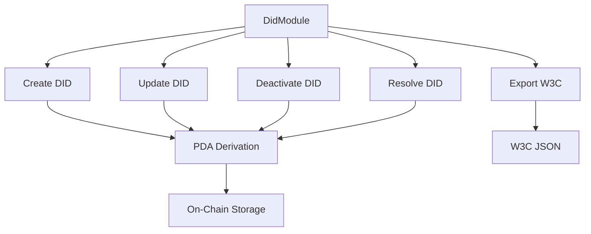

# DID Module API Reference

The **DidModule** provides complete functionality for managing W3C-compliant Decentralized Identifiers (DIDs) on Solana using the `did:sol` method specification.

## What You'll Learn

- How to create, update, and deactivate DID documents
- Working with verification methods and service endpoints
- Exporting DIDs to W3C format for cross-chain verification
- Best practices for DID management

## Prerequisites

- Basic understanding of Decentralized Identifiers (W3C DID Core)
- GhostSpeak SDK installed (`@ghostspeak/sdk`)
- A Solana wallet with devnet SOL for testing

---

## Installation

```bash
bun add @ghostspeak/sdk
```

## Quick Start

```typescript
import { GhostSpeakClient } from '@ghostspeak/sdk'
import { generateKeyPairSigner } from '@solana/signers'

const client = new GhostSpeakClient({ cluster: 'devnet' })
const signer = await generateKeyPairSigner()

// Create a DID
await client.did.create(signer, {
  controller: signer.address,
  network: 'devnet'
})

// Resolve the DID
const didDoc = await client.did.resolve(signer.address)
console.log(didDoc)
```

---

## Architecture



The DID Module manages on-chain DID documents stored as Program Derived Addresses (PDAs) on Solana. Each controller address has exactly one DID document.

---

## Core Methods

### `create(signer, params)`

Create a new DID document on-chain.

#### Parameters

| Parameter | Type | Description |
|-----------|------|-------------|
| `signer` | `TransactionSigner` | Transaction signer (becomes controller) |
| `params` | `CreateDidDocumentParams` | DID creation parameters |

#### CreateDidDocumentParams

```typescript
interface CreateDidDocumentParams {
  // Controller public key
  controller: Address

  // Initial verification methods (optional)
  verificationMethods?: VerificationMethod[]

  // Initial service endpoints (optional)
  serviceEndpoints?: ServiceEndpoint[]

  // Network identifier
  network?: 'mainnet' | 'devnet' | 'testnet'
}
```

#### Returns

`Promise<string>` - Transaction signature

#### Example

```typescript
const signature = await client.did.create(signer, {
  controller: signer.address,
  network: 'devnet',
  verificationMethods: [{
    id: 'key-1',
    methodType: VerificationMethodType.Ed25519VerificationKey2020,
    controller: 'did:sol:devnet:5VKz...',
    publicKeyMultibase: 'z6MkpTHR8VNsBxYAAWHut2Geadd9jSwuBV8xRoAnwWsdvktH',
    relationships: [VerificationRelationship.Authentication],
    createdAt: Date.now() / 1000,
    revoked: false
  }],
  serviceEndpoints: [{
    id: 'agent-api',
    serviceType: ServiceEndpointType.AIAgentService,
    serviceEndpoint: 'https://my-agent.example.com/api',
    description: 'AI Agent Service Endpoint'
  }]
})

console.log('DID created:', signature)
```

#### Error Handling

```typescript
try {
  await client.did.create(signer, params)
} catch (error) {
  if (error.code === 'AlreadyExists') {
    console.error('DID already exists for this controller')
  } else if (error.code === 'TooManyVerificationMethods') {
    console.error('Maximum 10 verification methods allowed')
  }
  throw error
}
```

---

### `update(signer, params)`

Update an existing DID document.

#### Parameters

| Parameter | Type | Description |
|-----------|------|-------------|
| `signer` | `TransactionSigner` | Must be the controller |
| `params` | `UpdateDidDocumentParams` | Update parameters |

#### UpdateDidDocumentParams

```typescript
interface UpdateDidDocumentParams {
  // DID document PDA address
  didDocument: Address

  // Add a new verification method
  addVerificationMethod?: VerificationMethod

  // Remove verification method by ID
  removeVerificationMethodId?: string

  // Add a new service endpoint
  addServiceEndpoint?: ServiceEndpoint

  // Remove service endpoint by ID
  removeServiceEndpointId?: string
}
```

#### Returns

`Promise<string>` - Transaction signature

#### Example

```typescript
// Get the DID document PDA first
const [didPda] = await client.did.deriveDidPda(signer.address)

// Add a new verification method
await client.did.update(signer, {
  didDocument: didPda,
  addVerificationMethod: {
    id: 'key-2',
    methodType: VerificationMethodType.X25519KeyAgreementKey2020,
    controller: 'did:sol:devnet:5VKz...',
    publicKeyMultibase: 'z6LSbysY2xFMRpGMhb7tFTLMpeuPRaqaWM1yECx2AtzE3KCc',
    relationships: [VerificationRelationship.KeyAgreement],
    createdAt: Date.now() / 1000,
    revoked: false
  }
})

// Remove a service endpoint
await client.did.update(signer, {
  didDocument: didPda,
  removeServiceEndpointId: 'old-endpoint'
})
```

---

### `deactivate(signer, params)`

Deactivate a DID document. This action is **irreversible**.

#### Parameters

| Parameter | Type | Description |
|-----------|------|-------------|
| `signer` | `TransactionSigner` | Must be the controller |
| `params` | `DeactivateDidDocumentParams` | Deactivation parameters |

#### DeactivateDidDocumentParams

```typescript
interface DeactivateDidDocumentParams {
  // DID document PDA address
  didDocument: Address
}
```

#### Returns

`Promise<string>` - Transaction signature

#### Example

```typescript
const [didPda] = await client.did.deriveDidPda(signer.address)

await client.did.deactivate(signer, {
  didDocument: didPda
})

console.log('DID deactivated permanently')
```

#### Warning

Deactivation is permanent and cannot be reversed. Use with caution.

---

### `resolve(didOrController)`

Resolve a DID document by DID string or controller address.

#### Parameters

| Parameter | Type | Description |
|-----------|------|-------------|
| `didOrController` | `string \| Address` | DID string or controller address |

#### Returns

`Promise<DidDocument | null>` - DID document or null if not found

#### Example

```typescript
// Resolve by controller address
const didDoc = await client.did.resolve(controllerAddress)

// Resolve by DID string
const didDoc2 = await client.did.resolve('did:sol:devnet:5VKz...')

if (didDoc) {
  console.log('DID:', didDoc.did)
  console.log('Controller:', didDoc.controller)
  console.log('Verification Methods:', didDoc.verificationMethods.length)
  console.log('Service Endpoints:', didDoc.serviceEndpoints.length)
  console.log('Active:', !didDoc.deactivated)
}
```

---

### `exportW3C(didOrController, pretty?)`

Export a DID document as W3C-compliant JSON string.

#### Parameters

| Parameter | Type | Description |
|-----------|------|-------------|
| `didOrController` | `string \| Address` | DID string or controller address |
| `pretty` | `boolean` | Pretty-print JSON (default: true) |

#### Returns

`Promise<string | null>` - W3C DID document JSON or null

#### Example

```typescript
const w3cJson = await client.did.exportW3C(controllerAddress, true)
console.log(w3cJson)

// Output:
// {
//   "@context": [
//     "https://www.w3.org/ns/did/v1",
//     "https://w3id.org/security/suites/ed25519-2020/v1"
//   ],
//   "id": "did:sol:devnet:5VKz...",
//   "controller": "did:sol:devnet:5VKz...",
//   "verificationMethod": [...],
//   "authentication": [...],
//   "service": [...]
// }
```

---

### `getW3CDocument(didOrController)`

Get W3C DID document as JavaScript object.

#### Parameters

| Parameter | Type | Description |
|-----------|------|-------------|
| `didOrController` | `string \| Address` | DID string or controller address |

#### Returns

`Promise<W3CDidDocument | null>` - W3C DID document object or null

#### Example

```typescript
const w3cDoc = await client.did.getW3CDocument(controllerAddress)

if (w3cDoc) {
  console.log('Context:', w3cDoc['@context'])
  console.log('ID:', w3cDoc.id)
  console.log('Verification Methods:', w3cDoc.verificationMethod)
}
```

---

## Helper Methods

### `deriveDidPda(controller)`

Derive the DID document PDA for a controller address.

#### Parameters

| Parameter | Type | Description |
|-----------|------|-------------|
| `controller` | `Address` | Controller address |

#### Returns

`Promise<[Address, number]>` - PDA address and bump seed

#### Example

```typescript
const [didPda, bump] = await client.did.deriveDidPda(controllerAddress)
console.log('DID PDA:', didPda)
console.log('Bump:', bump)
```

---

### `generateDid(controller, network?)`

Generate a DID string for a controller address.

#### Parameters

| Parameter | Type | Description |
|-----------|------|-------------|
| `controller` | `Address` | Controller address |
| `network` | `'mainnet' \| 'devnet' \| 'testnet'` | Network (default: 'devnet') |

#### Returns

`string` - DID string

#### Example

```typescript
const did = client.did.generateDid(controllerAddress, 'devnet')
console.log(did)
// Output: "did:sol:devnet:5VKz..."
```

---

### `validateDid(did)`

Validate a DID string format.

#### Parameters

| Parameter | Type | Description |
|-----------|------|-------------|
| `did` | `string` | DID string to validate |

#### Returns

`boolean` - True if valid (throws on invalid)

#### Example

```typescript
try {
  const valid = client.did.validateDid('did:sol:devnet:5VKz...')
  console.log('Valid DID:', valid)
} catch (error) {
  console.error('Invalid DID format:', error.message)
}
```

---

### `isActive(didOrController)`

Check if a DID is active (not deactivated).

#### Parameters

| Parameter | Type | Description |
|-----------|------|-------------|
| `didOrController` | `string \| Address` | DID string or controller address |

#### Returns

`Promise<boolean>` - True if active, false if deactivated or not found

#### Example

```typescript
const active = await client.did.isActive(controllerAddress)
if (active) {
  console.log('DID is active')
} else {
  console.log('DID is deactivated or does not exist')
}
```

---

## Type Definitions

### DidDocument

```typescript
interface DidDocument {
  // The DID string (e.g., "did:sol:devnet:...")
  did: string

  // Controller of the DID
  controller: Address

  // Verification methods (public keys)
  verificationMethods: VerificationMethod[]

  // Service endpoints
  serviceEndpoints: ServiceEndpoint[]

  // W3C context URIs
  context: string[]

  // Alternative DIDs
  alsoKnownAs: string[]

  // Timestamps
  createdAt: number
  updatedAt: number

  // Version number
  version: number

  // Deactivation status
  deactivated: boolean
  deactivatedAt?: number

  // PDA bump
  bump: number
}
```

### VerificationMethod

```typescript
interface VerificationMethod {
  // Method identifier (e.g., "key-1")
  id: string

  // Type of verification method
  methodType: VerificationMethodType

  // Controller DID
  controller: string

  // Public key in multibase format
  publicKeyMultibase: string

  // Verification relationships
  relationships: VerificationRelationship[]

  // Creation timestamp
  createdAt: number

  // Revoked flag
  revoked: boolean
}
```

### VerificationMethodType

```typescript
enum VerificationMethodType {
  // Ed25519 verification key (Solana native)
  Ed25519VerificationKey2020 = 'Ed25519VerificationKey2020',

  // X25519 key agreement for encryption
  X25519KeyAgreementKey2020 = 'X25519KeyAgreementKey2020',

  // Secp256k1 verification key (Ethereum compatibility)
  EcdsaSecp256k1VerificationKey2019 = 'EcdsaSecp256k1VerificationKey2019',
}
```

### VerificationRelationship

```typescript
enum VerificationRelationship {
  // Key can authenticate as the DID
  Authentication = 'authentication',

  // Key can assert claims (issue credentials)
  AssertionMethod = 'assertionMethod',

  // Key can perform key agreement (encryption)
  KeyAgreement = 'keyAgreement',

  // Key can invoke capabilities (update DID document)
  CapabilityInvocation = 'capabilityInvocation',

  // Key can delegate capabilities
  CapabilityDelegation = 'capabilityDelegation',
}
```

### ServiceEndpoint

```typescript
interface ServiceEndpoint {
  // Service identifier
  id: string

  // Type of service
  serviceType: ServiceEndpointType

  // Service endpoint URI
  serviceEndpoint: string

  // Optional description
  description: string
}
```

### ServiceEndpointType

```typescript
enum ServiceEndpointType {
  // AI agent service endpoint
  AIAgentService = 'AIAgentService',

  // Messaging service endpoint (DIDComm)
  DIDCommMessaging = 'DIDCommMessaging',

  // Credential repository
  CredentialRepository = 'CredentialRepository',

  // Linked domains verification
  LinkedDomains = 'LinkedDomains',

  // Custom service type
  Custom = 'Custom',
}
```

---

## Error Codes

| Error Code | Description | Resolution |
|------------|-------------|------------|
| `AlreadyDeactivated` | DID is already deactivated | Cannot update deactivated DIDs |
| `TooManyVerificationMethods` | Maximum 10 verification methods | Remove unused methods |
| `TooManyServiceEndpoints` | Maximum 5 service endpoints | Remove unused endpoints |
| `DuplicateMethodId` | Verification method ID already exists | Use unique IDs |
| `DuplicateServiceId` | Service endpoint ID already exists | Use unique IDs |
| `MethodNotFound` | Verification method not found | Check method ID |
| `ServiceNotFound` | Service endpoint not found | Check service ID |
| `InvalidDidFormat` | DID string format is invalid | Use `did:sol:network:address` format |
| `UnauthorizedDidOperation` | Signer is not the controller | Only controller can modify |
| `DidDeactivated` | Cannot operate on deactivated DID | DID is deactivated |

---

## Best Practices

### 1. Use Verification Relationships Correctly

```typescript
// Authentication key for signing
{
  id: 'auth-key',
  methodType: VerificationMethodType.Ed25519VerificationKey2020,
  relationships: [VerificationRelationship.Authentication]
}

// Encryption key for secure messaging
{
  id: 'encrypt-key',
  methodType: VerificationMethodType.X25519KeyAgreementKey2020,
  relationships: [VerificationRelationship.KeyAgreement]
}

// Credential issuing key
{
  id: 'issuer-key',
  methodType: VerificationMethodType.Ed25519VerificationKey2020,
  relationships: [VerificationRelationship.AssertionMethod]
}
```

### 2. Regularly Update Service Endpoints

```typescript
// Update endpoint when service URL changes
await client.did.update(signer, {
  didDocument: didPda,
  removeServiceEndpointId: 'old-api',
  addServiceEndpoint: {
    id: 'new-api',
    serviceType: ServiceEndpointType.AIAgentService,
    serviceEndpoint: 'https://new-endpoint.example.com/api',
    description: 'Updated API endpoint'
  }
})
```

### 3. Validate Before Deactivation

```typescript
// Check if DID is active before deactivating
const active = await client.did.isActive(controllerAddress)

if (active) {
  console.warn('WARNING: This will permanently deactivate the DID')
  // Confirm with user
  await client.did.deactivate(signer, { didDocument: didPda })
}
```

### 4. Export for Cross-Chain Verification

```typescript
// Export to W3C format for use on other chains
const w3cJson = await client.did.exportW3C(controllerAddress)

// Send to Crossmint or other cross-chain bridge
await crossmintClient.verifyDid(w3cJson)
```

---

## Troubleshooting

### Issue: "DID instructions are not yet generated"

**Cause**: The DID instructions haven't been generated from the Anchor program IDL.

**Solution**:
```bash
cd programs/ghostspeak-marketplace
bun run generate:client
```

### Issue: "Unauthorized DID operation"

**Cause**: Signer is not the controller of the DID.

**Solution**: Ensure the signer address matches the DID's controller address.

### Issue: "Too many verification methods"

**Cause**: Maximum of 10 verification methods per DID.

**Solution**: Remove unused verification methods before adding new ones.

### Issue: DID resolution returns null

**Cause**: DID document doesn't exist for the given controller.

**Solution**: Create the DID first using `create()` method.

---

## Next Steps

<CardGroup cols={2}>
  <Card title="Verifiable Credentials" icon="certificate" href="/guides/verifiable-credentials">
    Issue credentials using DIDs
  </Card>
  <Card title="Cross-Chain Verification" icon="bridge" href="/guides/crossmint-bridge">
    Export DIDs to other chains
  </Card>
  <Card title="DID Integration Guide" icon="book" href="/guides/did-integration">
    Step-by-step integration tutorial
  </Card>
  <Card title="Examples" icon="code" href="/examples/did-operations">
    Runnable code examples
  </Card>
</CardGroup>

---

## Related Resources

- [W3C DID Core Specification](https://www.w3.org/TR/did-core/)
- [did:sol Method Specification](https://github.com/identity-com/sol-did/blob/develop/sol-did-method-spec.md)
- [DID Use Cases](https://www.w3.org/TR/did-use-cases/)
