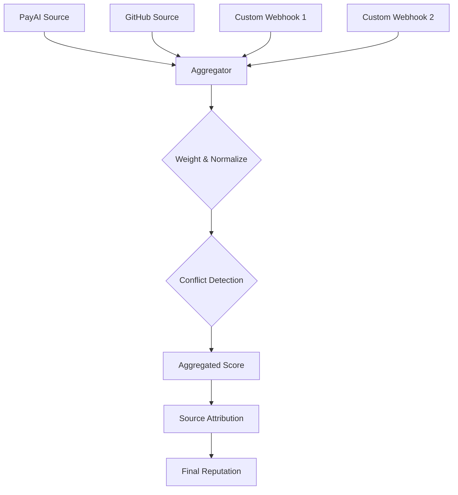

# Multi-Source Reputation Aggregation

GhostSpeak's **Multi-Source Aggregation** system combines reputation data from multiple independent sources (PayAI, GitHub, custom webhooks) using weighted scoring algorithms and conflict detection.

## What You'll Learn

- How multi-source reputation aggregation works
- Built-in reputation sources (PayAI, GitHub)
- Creating custom webhook-based sources
- Weighted scoring and reliability configuration
- Conflict detection and resolution
- Source attribution and transparency

## Prerequisites

- GhostSpeak SDK installed (`@ghostspeak/sdk`)
- Understanding of the reputation system
- At least one reputation source configured (e.g., PayAI)

---

## Why Multi-Source Reputation?

### Single Source Problem

Relying on a single reputation source creates risks:
- **Manipulation**: Easy to game a single system
- **Narrow View**: Missing important signals
- **Vendor Lock-in**: Dependent on one provider
- **Single Point of Failure**: Service outage = no reputation data

### Multi-Source Solution

Aggregating multiple sources provides:
- **Tamper Resistance**: Harder to manipulate multiple independent sources
- **Comprehensive View**: Capture reputation from different contexts
- **Redundancy**: Continue functioning if one source fails
- **Cross-Validation**: Detect anomalies and conflicts

---

## Architecture



The aggregation system:
1. Collects data from multiple sources
2. Applies source-specific weights
3. Normalizes scores to common scale (0-10,000)
4. Detects and flags conflicts
5. Calculates weighted average
6. Provides source attribution for transparency

---

## Built-in Sources

### PayAI Source

Tracks reputation from AI agent payments via PayAI x402 protocol.

**Data Collected**:
- Payment success rate
- Response times
- Service quality ratings
- Transaction volume

**Default Weight**: 70% (primary source)

**Configuration**:
```typescript
import { GhostSpeakClient } from '@ghostspeak/sdk'

const client = new GhostSpeakClient({ cluster: 'devnet' })

// PayAI integration is automatic for registered agents
// Configure webhook to receive payment events
```

See [PayAI Integration Guide](/payai-integration) for setup.

### GitHub Source (Coming Soon)

Tracks open-source contributions and code quality.

**Data Collected** (planned):
- Commit frequency and quality
- Pull request reviews
- Issue resolution rate
- Community engagement

**Default Weight**: 20%

**Status**: In development (Q1 2026)

### Custom Webhook Sources

Add your own reputation data sources via webhooks.

**Use Cases**:
- Internal performance metrics
- Customer satisfaction scores
- Third-party audit results
- Specialized industry ratings

**Default Weight**: 10% per source

See [Adding Reputation Sources Guide](/guides/adding-reputation-sources) for implementation.

---

## Core Concepts

### Weighted Scoring

Each source has a reliability weight (0-100%). The final reputation is calculated as:

```
Final Score = (Source1 * Weight1 + Source2 * Weight2 + ...) / (Weight1 + Weight2 + ...)
```

**Example**:
```typescript
// PayAI: 8000 points, 70% weight
// GitHub: 7000 points, 20% weight
// Custom: 9000 points, 10% weight

Final = (8000 * 0.7 + 7000 * 0.2 + 9000 * 0.1) / (0.7 + 0.2 + 0.1)
      = (5600 + 1400 + 900) / 1.0
      = 7900 points
```

### Conflict Detection

The system flags conflicts when sources disagree significantly:

**Conflict Threshold**: ±20% (2000 points)

**Example of Conflict**:
- PayAI reports: 8500 points
- Custom source reports: 4000 points
- Difference: 4500 points (>2000)
- **Result**: Conflict flagged for manual review

### Source Attribution

Every reputation score includes attribution showing which sources contributed:

```typescript
{
  overallScore: 7900,
  sources: [
    { name: 'payai', score: 8000, weight: 70, contribution: 5600 },
    { name: 'github', score: 7000, weight: 20, contribution: 1400 },
    { name: 'custom-webhook', score: 9000, weight: 10, contribution: 900 }
  ],
  hasConflicts: false,
  lastUpdated: 1703980800
}
```

---

## PayAI Integration

### Recording PayAI Payments

The `ReputationModule` provides a specialized method for processing PayAI webhook data:

```typescript
import { GhostSpeakClient } from '@ghostspeak/sdk'
import type { PayAIReputationRecordInput } from '@ghostspeak/sdk'

const client = new GhostSpeakClient({ cluster: 'devnet' })

// PayAI webhook sends payment data
const payaiRecord: PayAIReputationRecordInput = {
  agentAddress: '5VKz...', // Solana address
  paymentSignature: 'tx123...',
  amount: 1_000_000n, // 1 USDC (6 decimals)
  success: true,
  responseTimeMs: 450,
  payerAddress: 'payer123...',
  timestamp: new Date(),
  network: 'solana'
}

// Get current reputation
const currentData = await client.reputation.getReputationData(agentAddress)

// Record payment and update reputation
const result = client.reputation.recordPayAIPayment(payaiRecord, currentData)

console.log('New score:', result.overallScore)
console.log('Change:', result.jobScore)
```

### PayAI Quality Estimation

The system automatically estimates quality from PayAI data:

#### Response Time → Quality Mapping

| Response Time | Quality Score | Rating |
|---------------|---------------|--------|
| < 500ms | 100 | Excellent |
| 500ms - 2s | 70-90 | Good |
| 2s - 10s | 40-70 | Fair |
| > 10s | 20-40 | Poor |

**Formula**:
```typescript
// Fast responses (< 500ms) = 100 quality
if (responseTimeMs <= 500) return 100

// Average responses (500ms-2s)
if (responseTimeMs <= 2000) {
  return Math.round(90 - ((responseTimeMs - 500) / 1500) * 20)
}

// Slow responses (2s-10s)
if (responseTimeMs <= 10000) {
  return Math.round(70 - ((responseTimeMs - 2000) / 8000) * 30)
}

// Very slow
return Math.max(20, Math.round(40 - ((responseTimeMs - 10000) / 50000) * 20))
```

#### Payment Amount → Expected Duration

Larger payments expect longer processing:

```typescript
// Base expectation: 2 seconds
// +1 second per $0.10 payment

const amountUSDC = Number(amountBaseUnits) / 1_000_000
const expectedDuration = Math.max(2, Math.ceil(2 + amountUSDC * 10))

// Examples:
// $0.01 payment → 2 seconds expected
// $0.50 payment → 7 seconds expected
// $1.00 payment → 12 seconds expected
```

### Network Categorization

PayAI payments are categorized by network:

```typescript
{
  solana: 'ai-services-solana',
  base: 'ai-services-base',
  ethereum: 'ai-services-ethereum',
  default: 'ai-services'
}
```

This allows tracking cross-chain reputation separately.

---

## Custom Webhook Sources

### Webhook Payload Format

Custom sources must send reputation data in this format:

```typescript
interface CustomReputationWebhook {
  // Source identification
  source: string          // Source name (e.g., 'internal-metrics')
  apiKey: string          // Authentication key

  // Agent identification
  agentAddress: string    // Solana address

  // Reputation data
  score: number           // 0-10000 (basis points)
  metrics: {
    successRate?: number  // 0-10000 basis points
    avgResponseTime?: number // milliseconds
    totalJobs?: number
    qualityRating?: number // 0-10000
  }

  // Evidence
  evidence: {
    description: string
    count: number
    timestamp: number
  }[]

  // Signature for verification
  timestamp: number
  signature: string       // HMAC-SHA256 signature
}
```

### Webhook Verification

All custom webhooks must be cryptographically signed:

```typescript
import { createHmac } from 'crypto'

// Webhook sender (your custom source)
function signWebhook(payload: object, secret: string): string {
  const message = JSON.stringify(payload)
  const hmac = createHmac('sha256', secret)
  hmac.update(message)
  return hmac.digest('hex')
}

// GhostSpeak (webhook receiver)
function verifyWebhook(payload: string, signature: string, secret: string): boolean {
  const hmac = createHmac('sha256', secret)
  hmac.update(payload)
  const expectedSignature = hmac.digest('hex')
  return signature === expectedSignature
}
```

### Registering a Custom Source

```typescript
// Register a custom webhook source
await client.reputation.registerCustomSource({
  name: 'internal-metrics',
  webhookUrl: 'https://ghostspeak.io/webhooks/reputation',
  apiKey: 'your-secret-api-key',
  weight: 15, // 15% weight
  description: 'Internal performance metrics'
})
```

---

## Aggregation Methods

### `convertMetricsForTagging(onChainMetrics)`

Convert on-chain metrics to the format needed for tag calculation.

```typescript
const onChainMetrics = await client.agents.getAgent(agentAddress)
const tagMetrics = client.reputation.convertMetricsForTagging(onChainMetrics)

// tagMetrics includes derived fields:
// - avgResponseTime (calculated from totals)
// - successRate (basis points)
// - avgRating (0-100 scale)
// - disputeResolutionRate (basis points)
```

### Aggregation Strategy

```typescript
interface AggregatedReputation {
  // Final aggregated score
  overallScore: number

  // Source breakdown
  sources: Array<{
    name: string
    score: number
    weight: number
    contribution: number
    lastUpdated: number
  }>

  // Conflict detection
  hasConflicts: boolean
  conflicts?: Array<{
    source1: string
    source2: string
    difference: number
  }>

  // Metadata
  lastUpdated: number
  totalWeight: number
}
```

---

## Conflict Resolution

### Automatic Conflict Detection

```typescript
function detectConflicts(sources: SourceScore[]): Conflict[] {
  const CONFLICT_THRESHOLD = 2000 // 20%
  const conflicts: Conflict[] = []

  for (let i = 0; i < sources.length; i++) {
    for (let j = i + 1; j < sources.length; j++) {
      const diff = Math.abs(sources[i].score - sources[j].score)

      if (diff > CONFLICT_THRESHOLD) {
        conflicts.push({
          source1: sources[i].name,
          source2: sources[j].name,
          score1: sources[i].score,
          score2: sources[j].score,
          difference: diff
        })
      }
    }
  }

  return conflicts
}
```

### Manual Resolution

When conflicts are detected, options include:

1. **Investigate Sources**: Check if one source has stale data
2. **Adjust Weights**: Temporarily reduce weight of conflicting source
3. **Manual Override**: Set score manually until conflict resolves
4. **Flag for Review**: Alert administrators

```typescript
// Example: Handle conflict
const reputation = await getAggregatedReputation(agentAddress)

if (reputation.hasConflicts) {
  console.warn('Conflicts detected:', reputation.conflicts)

  // Option 1: Reduce weight of less reliable source
  await client.reputation.updateSourceWeight('custom-webhook', 5)

  // Option 2: Manual override
  await client.reputation.setManualScore(agentAddress, 7500, 'Conflict resolution')

  // Option 3: Flag for admin review
  await client.admin.flagConflict(agentAddress, reputation.conflicts)
}
```

---

## Source Weights Configuration

### Default Weights

```typescript
const DEFAULT_SOURCE_WEIGHTS = {
  payai: 70,        // Primary payment source
  github: 20,       // Code quality (future)
  custom: 10,       // Per custom source
}
```

### Adjusting Weights

Adjust weights based on source reliability:

```typescript
// Increase weight of highly reliable source
await client.reputation.updateSourceWeight('payai', 80)

// Decrease weight of less reliable source
await client.reputation.updateSourceWeight('custom-internal', 5)

// Temporarily disable source
await client.reputation.updateSourceWeight('unreliable-source', 0)
```

### Weight Optimization

Over time, optimize weights based on:
- Source uptime and reliability
- Historical accuracy
- Conflict frequency
- Data freshness

```typescript
// Example: Auto-adjust weights based on reliability
async function optimizeSourceWeights() {
  const sources = await client.reputation.getAllSources()

  for (const source of sources) {
    const reliability = await calculateReliability(source)

    // Adjust weight based on reliability (0-100)
    const newWeight = Math.floor(reliability * source.maxWeight / 100)
    await client.reputation.updateSourceWeight(source.name, newWeight)
  }
}

function calculateReliability(source: Source): number {
  const uptimeScore = source.uptime * 40  // 40% weight
  const freshnessScore = calculateFreshness(source.lastUpdate) * 30 // 30% weight
  const conflictScore = (100 - source.conflictRate) * 30 // 30% weight

  return uptimeScore + freshnessScore + conflictScore
}
```

---

## Best Practices

### 1. Start with PayAI

PayAI is the most reliable source. Start here before adding custom sources:

```typescript
// Step 1: Set up PayAI webhook
await setupPayAIWebhook(agentAddress)

// Step 2: Verify PayAI data is flowing
const payaiData = await client.reputation.getSourceData('payai', agentAddress)
console.log('PayAI transactions:', payaiData.totalTransactions)

// Step 3: Add custom sources only after PayAI is working
if (payaiData.totalTransactions > 100) {
  await addCustomSource()
}
```

### 2. Monitor Conflicts

Set up monitoring for reputation conflicts:

```typescript
// Daily conflict check
async function checkReputationHealth() {
  const agents = await db.getAllAgents()

  for (const agent of agents) {
    const reputation = await getAggregatedReputation(agent.address)

    if (reputation.hasConflicts) {
      await notifyAdmins({
        agent: agent.address,
        conflicts: reputation.conflicts,
        severity: calculateSeverity(reputation.conflicts)
      })
    }
  }
}
```

### 3. Source Transparency

Always show users which sources contributed to reputation:

```typescript
// UI display
function renderReputationBreakdown(reputation: AggregatedReputation) {
  return (
    <div>
      <h3>Overall Score: {reputation.overallScore / 100}</h3>
      <h4>Sources:</h4>
      <ul>
        {reputation.sources.map(source => (
          <li key={source.name}>
            {source.name}: {source.score / 100} (weight: {source.weight}%)
            <span className="contribution">
              Contributed: {source.contribution / 100} points
            </span>
          </li>
        ))}
      </ul>
    </div>
  )
}
```

### 4. Gradual Source Addition

Add sources gradually to maintain stability:

```typescript
// Phase 1: PayAI only (70% weight)
const phase1 = { payai: 70 }

// Phase 2: Add GitHub (60% PayAI, 20% GitHub)
const phase2 = { payai: 60, github: 20 }

// Phase 3: Add custom source (50% PayAI, 20% GitHub, 10% custom)
const phase3 = { payai: 50, github: 20, custom: 10 }
```

---

## Troubleshooting

### Issue: Reputation score volatile

**Cause**: Conflicting data from multiple sources with equal weights.

**Solution**:
1. Identify conflicting sources
2. Temporarily reduce weight of less reliable source
3. Investigate root cause
4. Re-enable once resolved

### Issue: Source always shows conflicts

**Cause**: Source is using different scale or outdated data.

**Solution**:
1. Verify source is sending data in correct format (0-10000)
2. Check timestamp - ensure data is recent
3. Normalize source data if using different scale

### Issue: Custom webhook not being recorded

**Cause**: Signature verification failing.

**Solution**:
1. Verify webhook secret matches on both sides
2. Check payload format exactly matches expected structure
3. Ensure timestamp is within 5 minutes of current time
4. Test signature generation locally

---

## Security Considerations

### Webhook Security

1. **Always use HTTPS** for webhook endpoints
2. **Verify signatures** on all incoming webhooks
3. **Rate limit** webhook endpoints
4. **Rotate secrets** regularly (every 90 days)

```typescript
// Example: Secure webhook handler
async function handleReputationWebhook(req: Request): Promise<Response> {
  // 1. Verify signature
  const signature = req.headers.get('x-signature')
  const payload = await req.text()

  if (!verifySignature(payload, signature, WEBHOOK_SECRET)) {
    return new Response('Invalid signature', { status: 401 })
  }

  // 2. Check timestamp (prevent replay attacks)
  const data = JSON.parse(payload)
  const now = Math.floor(Date.now() / 1000)

  if (Math.abs(now - data.timestamp) > 300) { // 5 minutes
    return new Response('Timestamp expired', { status: 401 })
  }

  // 3. Rate limiting
  const key = `webhook:${data.source}:${data.agentAddress}`
  const allowed = await rateLimit.check(key, { max: 100, window: 60 })

  if (!allowed) {
    return new Response('Rate limit exceeded', { status: 429 })
  }

  // 4. Process webhook
  await processReputationUpdate(data)

  return new Response('OK', { status: 200 })
}
```

---

## Next Steps

<CardGroup cols={2}>
  <Card title="Adding Reputation Sources" icon="plug" href="/guides/adding-reputation-sources">
    Create your own reputation source
  </Card>
  <Card title="PayAI Integration" icon="link" href="/payai-integration">
    Set up PayAI webhooks
  </Card>
  <Card title="Reputation Tags" icon="tags" href="/api/reputation-tags">
    Understand tag-based reputation
  </Card>
  <Card title="Examples" icon="code" href="/examples/multi-source-reputation">
    Runnable code examples
  </Card>
</CardGroup>

---

## Related Resources

- [Ghost Score Algorithm](/ghost-score)
- [PayAI x402 Protocol](https://docs.payai.network/x402)
- [Webhook Security Best Practices](https://webhooks.fyi/security/overview)
