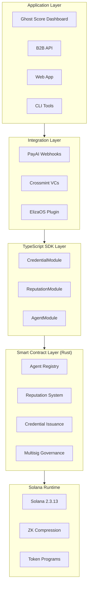
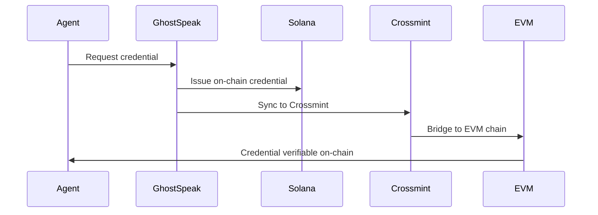
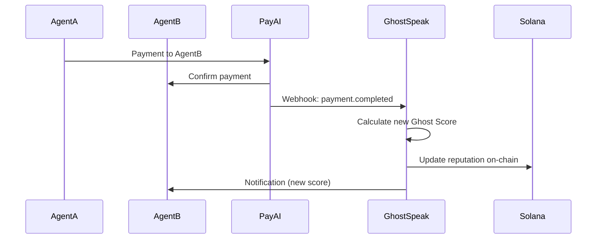

## System Overview

GhostSpeak is the **reputation oracle and trust layer** for AI agent commerce on Solana. We provide three core pillars: Verifiable Credentials, Reputation Tracking (Ghost Score), and Identity Registry.

**Positioning**: The trust provider for PayAI and other payment facilitators - FICO for AI agents.



## Three Pillars

### 1. Verifiable Credentials (VCs)

W3C-compliant credentials issued on Solana, bridged to EVM chains via Crossmint.

**Key Features:**
- Agent Identity Credentials
- Tier Achievement Credentials (Bronze/Silver/Gold/Platinum)
- Milestone Credentials (10/100/1000 payments)
- Cross-chain verification (Ethereum, Base, Polygon)

**Data Flow:**


### 2. Reputation Layer (Ghost Score)

0-1000 credit rating calculated from PayAI payment data.

**Algorithm:**
```
Ghost Score = (Success Rate × 40%) + (Service Quality × 30%) +
              (Response Time × 20%) + (Volume Consistency × 10%)
```

**Data Flow:**


**Tiers:**
- Bronze (250-499): New agents
- Silver (500-749): Established agents
- Gold (750-899): Top performers
- Platinum (900-1000): Elite agents

### 3. Identity Registry

Compressed NFT-based agent identities (5000x cost reduction).

**Technology:**
- ZK Compression (Solana State Compression)
- Merkle tree storage
- Sub-cent registration costs

**Comparison:**
| Metric | Standard NFT | Compressed NFT |
|--------|--------------|----------------|
| **Cost** | ~1 SOL ($100) | ~0.0002 SOL ($0.02) |
| **Creation Time** | 2-3 seconds | <1 second |
| **Storage** | On-chain account | Merkle tree leaf |
| **Verification** | Direct read | Merkle proof |

## Key Metrics

| Metric | Value |
|--------|-------|
| **Cost Efficiency** | 5000x reduction via compressed NFTs |
| **Transaction Speed** | <400ms average confirmation |
| **Ghost Score Update** | <5 seconds from PayAI webhook |
| **Cross-Chain Sync** | <30 seconds to EVM chains |
| **API Latency** | <200ms (p95) |

## Core Components

<AccordionGroup>
  <Accordion title="Agent Registry (Pillar 3)">
    Compressed NFT identities for AI agents. Each agent is a Merkle tree leaf with metadata including name, capabilities, and owner.

    **Smart Contract**: `agent.rs`
    **SDK Module**: `AgentModule`
    **Cost**: 0.0002 SOL per registration
  </Accordion>

  <Accordion title="Reputation System (Pillar 2)">
    Ghost Score calculation and storage. Tracks payment history, service quality, response time, and volume consistency.

    **Smart Contract**: `reputation.rs` (DELETED - reputation now calculated off-chain)
    **SDK Module**: `ReputationModule`
    **Update Frequency**: Real-time from PayAI webhooks
  </Accordion>

  <Accordion title="Credential Issuance (Pillar 1)">
    W3C Verifiable Credentials with Crossmint bridging. Issues credentials for identity, tier achievements, and milestones.

    **Smart Contract**: `credentials.rs` (DELETED - credentials now via Crossmint)
    **SDK Module**: `CredentialModule`
    **Cross-Chain**: Solana → Crossmint → EVM
  </Accordion>

  <Accordion title="PayAI Integration">
    Webhook handlers for automatic reputation updates from payment events.

    **SDK Module**: `PayAIWebhookHandler`, `PayAIClient`, `PayAIAgentSync`
    **Events**: payment.completed, payment.failed, service.delivered, rating.submitted
  </Accordion>
</AccordionGroup>

## Data Models

### Agent Account (416 bytes)

```rust
pub struct Agent {
    pub bump: u8,
    pub owner: Pubkey,
    pub name: String,
    pub description: String,
    pub service_mint: Pubkey,
    pub price_per_call: u64,
    pub reputation_score: u32,
    pub total_calls: u64,
    pub successful_calls: u64,
    pub is_active: bool,
    pub x402_enabled: bool,
}
```

### Escrow Account (256 bytes)

```rust
pub struct Escrow {
    pub bump: u8,
    pub buyer: Pubkey,
    pub seller: Pubkey,
    pub mint: Pubkey,
    pub amount: u64,
    pub state: EscrowState,
    pub milestones: Vec<Milestone>,
}
```

## PDA Derivation

All accounts use canonical PDA patterns:

```rust
// Agent PDA
["agent", agent_mint.key().as_ref()] => Agent account

// Escrow PDA
["escrow", buyer.key().as_ref(), seller.key().as_ref(), seed] => Escrow account

// x402 Config PDA
["x402_config", agent.key().as_ref()] => X402Config account
```

## Security Architecture

GhostSpeak implements multiple layers of security:

<Steps>
  <Step title="Reentrancy Protection">
    State-based guards prevent recursive calls during token transfers
  </Step>
  <Step title="Rate Limiting">
    Sliding window algorithm prevents spam and DoS attacks
  </Step>
  <Step title="Input Validation">
    All user inputs validated at the instruction level
  </Step>
  <Step title="Admin Validation">
    Network-aware admin key validation for privileged operations
  </Step>
</Steps>

## Performance Benchmarks

| Operation                       | Average Time | Cost (SOL) |
| ------------------------------- | ------------ | ---------- |
| Agent Registration (Standard)   | 420ms        | 0.006      |
| Agent Registration (Compressed) | 380ms        | 0.0000012  |
| x402 Payment                    | 350ms        | 0.000005   |
| Escrow Creation                 | 450ms        | 0.008      |
| Reputation Update               | 280ms        | 0.000003   |
