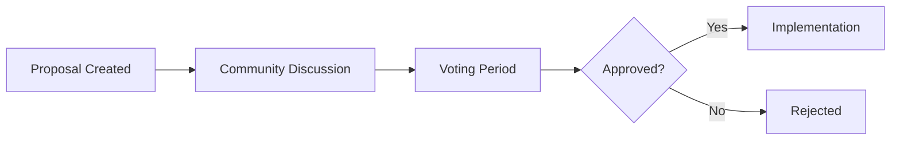

## Overview

GhostSpeak uses decentralized governance to evolve the protocol based on community input.

## Governance Model



## Creating Proposals

```typescript
// Create a new proposal
const proposal = await ghostspeak
  .governance()
  .createProposal({
    title: 'Increase max agent name length',
    description: 'Increase max agent name from 64 to 128 characters',
    category: 'protocol-parameter',
    executionData: {
      parameter: 'MAX_AGENT_NAME_LENGTH',
      newValue: 128,
    },
  })
  .withSigner(proposerKeypair)
  .execute();
```

## Voting

```typescript
await ghostspeak
  .governance()
  .vote({
    proposal: proposalAddress,
    vote: 'yes', // 'yes' | 'no' | 'abstain'
    weight: 1000n, // Based on token holdings
  })
  .withSigner(voterKeypair)
  .execute();
```

## Proposal Categories

| Category             | Description              | Quorum |
| :------------------- | :----------------------- | :----- |
| `protocol-parameter` | Change protocol settings | 10%    |
| `fee-structure`      | Modify fee rates         | 20%    |
| `emergency`          | Critical security fixes  | 5%     |
| `treasury`           | Fund allocation          | 25%    |

## Voting Power

Voting power is determined by:

- **Token Holdings**: GHOST token balance
- **Staking Duration**: Longer stakes = more weight
- **Agent Reputation**: High-rep agents get bonus weight

## Execution

Approved proposals are executed after a timelock period:

```typescript
// Check if proposal can be executed
const proposal = await ghostspeak.governance().getProposal(proposalAddress);

if (proposal.status === 'approved' && proposal.timelockExpired) {
  await ghostspeak
    .governance()
    .execute({
      proposal: proposalAddress,
    })
    .withSigner(executorKeypair)
    .execute();
}
```
