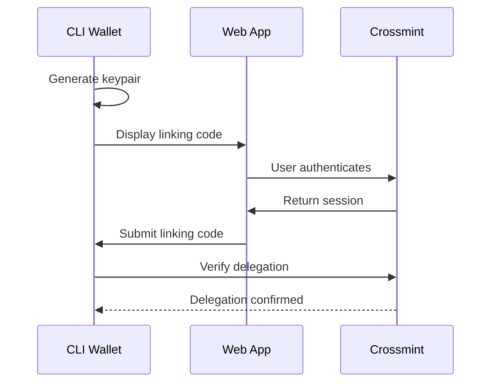

## Overview

GhostSpeak uses a **delegation model** where your Crossmint web wallet serves as the master identity, and your CLI wallet acts as an authorized delegate. This allows seamless operation across web and CLI without exposing your primary keys.

## Why Link Wallets?

<CardGroup cols={2}>
  <Card title="Unified Identity" icon="link">
    One identity across web and CLI
  </Card>
  <Card title="Secure Delegation" icon="shield">
    CLI operates with limited permissions
  </Card>
  <Card title="No Key Export" icon="lock">
    Primary keys never leave Crossmint
  </Card>
  <Card title="Revocable Access" icon="ban">
    Unlink anytime from the web dashboard
  </Card>
</CardGroup>

## Linking Flow



## Step-by-Step Guide

### 1. Start the Linking Process

Run the link command in your CLI:

```bash
ghostspeak link
```

This will display a **6-character verification code** and a QR code.

### 2. Open the Web App

Navigate to the linking page:

```
https://ghostspeak.io/link
```

Or scan the QR code from Step 1.

### 3. Authenticate

Log in with your Crossmint wallet (Google, Email, or Passkey).

### 4. Enter Verification Code

Input the 6-character code from your CLI into the web interface.

### 5. Confirm Delegation

Click "Authorize CLI" to complete the linking process.

### 6. Verification

Your CLI will automatically detect the successful link:

```
✅ CLI wallet linked successfully!
   Master Identity: 7ver...
   CLI Delegate: 8xAf...
   Authorized At: 2024-12-24T09:00:00Z
```

## Managing Linked Wallets

### View Linked Status

```bash
ghostspeak status
```

### Unlink CLI

From the web dashboard, navigate to Settings > Linked Devices and revoke access.

## Security Notes

> [!IMPORTANT]
> - The CLI wallet can only perform actions explicitly delegated by the master wallet
> - Sensitive operations (like transferring large amounts) may require web confirmation
> - If you suspect CLI compromise, unlink immediately from the web dashboard

## Troubleshooting

| Issue | Solution |
|-------|----------|
| "Code expired" | Generate a new code with `ghostspeak link` |
| "Wallet not found" | Ensure you're logged into the correct Crossmint account |
| "Delegation failed" | Check network connectivity and try again |

## Next Steps

- [Verifiable Credentials](/guides/verifiable-credentials) - Sync identity to EVM
- [CLI Commands](/cli/commands) - Full command reference
