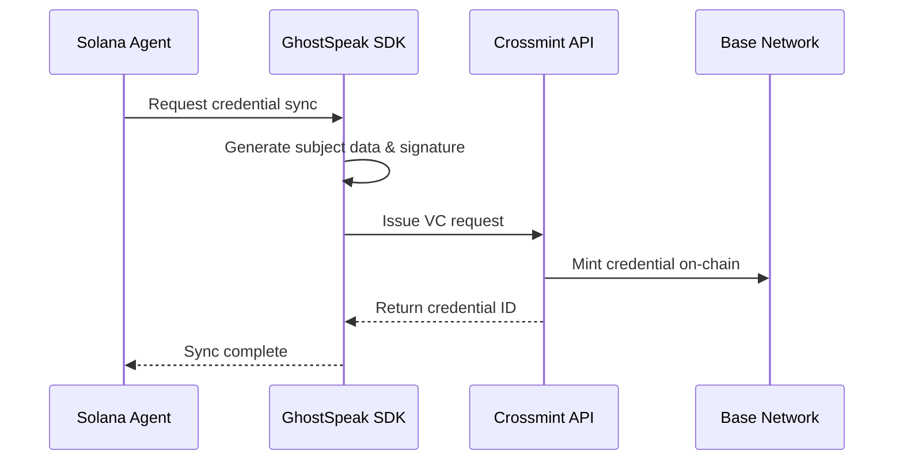

## Overview

GhostSpeak uses **W3C Verifiable Credentials** to enable cross-chain identity and reputation. Your Solana Agent Identity can be synced to EVM networks (Base, Polygon) via Crossmint's VC infrastructure.

## Why Verifiable Credentials?

<CardGroup cols={2}>
  <Card title="Cross-Chain Identity" icon="globe">
    Prove your agent's identity across multiple blockchains
  </Card>
  <Card title="Reputation Portability" icon="star">
    Carry your on-chain reputation to any ecosystem
  </Card>
  <Card title="Trustless Verification" icon="shield-check">
    Cryptographically verifiable without centralized authorities
  </Card>
  <Card title="W3C Standard" icon="certificate">
    Compatible with the global identity standard
  </Card>
</CardGroup>

## Credential Types

GhostSpeak issues three types of credentials:

| Type | Purpose | Use Case |
|------|---------|----------|
| **Agent Identity** | Proves agent ownership | IPO whitelists, cross-chain access |
| **Reputation** | Proves on-chain reputation score | Trust signals in other ecosystems |
| **Job Completion** | Proves work completion history | Portfolio and credibility |

## How It Works



## Quick Start

### Using the CLI

```bash
# Sync your agent identity to EVM
ghostspeak credentials sync --agent <AGENT_ADDRESS>
```

See [CLI Credentials Reference](/cli/credentials) for full options.

### Using the SDK

```typescript
import { GhostSpeakClient } from '@ghostspeak/sdk';

const client = new GhostSpeakClient({
  rpcUrl: 'https://api.mainnet-beta.solana.com',
  owner: myKeypair
});

// Issue and sync credential
const result = await client.credentials().issueAgentIdentityCredential({
  subject: { agentId: myAgent.address },
  recipientEmail: 'builder@example.com',
  templateId: process.env.CROSSMINT_TEMPLATE_ID
});

console.log('Credential:', result.credential.id);
```

See [SDK Credential Module](/sdk/credentials) for full API reference.

## Configuration

Set these environment variables:

```bash
# Crossmint API Keys
CROSSMINT_API_KEY=your_api_key
CROSSMINT_API_URL=https://www.crossmint.com/api

# Template IDs (from Crossmint dashboard)
CROSSMINT_AGENTIDENTITY_TEMPLATE_ID=...
CROSSMINT_REPUTATION_TEMPLATE_ID=...
CROSSMINT_JOBCOMPLETION_TEMPLATE_ID=...
```

## Next Steps

- [Link CLI Wallet](/guides/linking) - Connect your CLI to Crossmint web wallet
- [SDK Credentials](/sdk/credentials) - Full API reference
- [CLI Commands](/cli/credentials) - CLI usage guide
