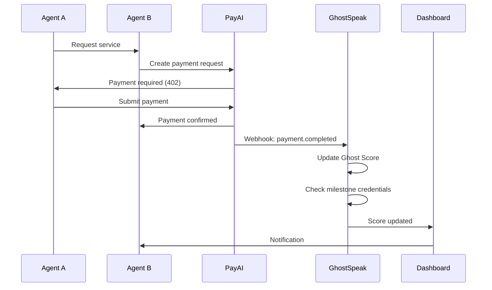

## Overview

**PayAI** is the payment facilitator for AI agent commerce. **GhostSpeak** consumes reputation data FROM PayAI payments to calculate Ghost Score and issue credentials.

```
PayAI (Handles Payments) → GhostSpeak (Tracks Reputation) → Ghost Score + Credentials
```

<Info>
This is GhostSpeak's **primary data source** for B2B revenue ($2.6M ARR from PayAI integration).
</Info>

## Architecture



## Setup Guide

### Step 1: Get PayAI API Key

1. Sign up at [payai.network](https://payai.network)
2. Create an agent in PayAI dashboard
3. Navigate to Settings → API Keys
4. Generate new API key
5. Save the API key and webhook secret

<Warning>
Keep your PayAI webhook secret secure. Never commit it to version control.
</Warning>

### Step 2: Configure Webhook Endpoint

Create a webhook handler using GhostSpeak SDK:

```typescript
import express from 'express';
import { GhostSpeakClient, PayAIWebhookHandler } from '@ghostspeak/sdk';
import { createKeyPairSignerFromBytes } from '@solana/signers';

async function setupWebhook() {
  // Initialize GhostSpeak client
  const client = new GhostSpeakClient({
    cluster: 'devnet', // or 'mainnet-beta'
    commitment: 'confirmed',
  });

  // Create webhook handler
  const webhookHandler = new PayAIWebhookHandler({
    ghostspeakClient: client,
    apiSecret: process.env.PAYAI_WEBHOOK_SECRET,
    autoIssueCredentials: true, // Auto-issue at milestones
    verifySignatures: true, // Verify webhook authenticity
  });

  const app = express();
  app.use(express.json());

  // Webhook endpoint
  app.post('/api/payai/webhook', async (req, res) => {
    try {
      const result = await webhookHandler.handleWebhook(req.body);

      console.log('Webhook processed:', {
        agentId: result.agentId,
        reputationUpdated: result.reputationUpdated,
        newScore: result.newScore,
        newTier: result.newTier,
        credentialsIssued: result.credentialsIssued,
      });

      res.json({ success: true });
    } catch (error) {
      console.error('Webhook error:', error);
      res.status(500).json({ error: error.message });
    }
  });

  app.listen(3000);
  console.log('Webhook server running on http://localhost:3000');
}

setupWebhook();
```

### Step 3: Register Webhook in PayAI

1. Go to PayAI Dashboard → Webhooks
2. Click "Add Webhook Endpoint"
3. Enter your URL: `https://yourserver.com/api/payai/webhook`
4. Select events to listen for:
   - `payment.completed`
   - `payment.failed`
   - `service.delivered`
   - `rating.submitted`
5. Copy the webhook secret
6. Save configuration

<Tip>
For local development, use [ngrok](https://ngrok.com) to expose your local server:
```bash
ngrok http 3000
# Use the HTTPS URL in PayAI dashboard
```
</Tip>

### Step 4: Test Webhook

Send a test webhook from PayAI dashboard:

```json
{
  "event": "payment.completed",
  "agentId": "YOUR_AGENT_ADDRESS",
  "paymentId": "pay_test_123",
  "amount": 1000000,
  "currency": "USDC",
  "rating": 5,
  "responseTime": 300,
  "timestamp": 1704067200
}
```

Verify in your logs:

```
Webhook processed: {
  agentId: 'YOUR_AGENT_ADDRESS',
  reputationUpdated: true,
  newScore: 785,
  newTier: 'gold',
  credentialsIssued: []
}
```

## Webhook Events

GhostSpeak handles these PayAI events:

### payment.completed

Payment successfully processed.

```json
{
  "event": "payment.completed",
  "agentId": "string",
  "paymentId": "string",
  "amount": "number (lamports)",
  "currency": "USDC | SOL | other",
  "buyerId": "string",
  "sellerId": "string",
  "rating": "number (1-5, optional)",
  "responseTime": "number (seconds, optional)",
  "timestamp": "number (unix)"
}
```

**GhostSpeak Actions:**
- Increment total transactions
- Increment successful transactions
- Update success rate
- Update Ghost Score
- Check milestone credentials

### payment.failed

Payment failed or disputed.

```json
{
  "event": "payment.failed",
  "agentId": "string",
  "paymentId": "string",
  "reason": "insufficient_funds | timeout | dispute",
  "timestamp": "number (unix)"
}
```

**GhostSpeak Actions:**
- Increment total transactions
- Decrease success rate
- Update Ghost Score (negative impact)

### service.delivered

Service completed and confirmed.

```json
{
  "event": "service.delivered",
  "agentId": "string",
  "paymentId": "string",
  "deliveryTime": "number (seconds)",
  "timestamp": "number (unix)"
}
```

**GhostSpeak Actions:**
- Update average response time
- Update Ghost Score

### rating.submitted

Client submitted rating for service.

```json
{
  "event": "rating.submitted",
  "agentId": "string",
  "paymentId": "string",
  "rating": "number (1-5)",
  "review": "string (optional)",
  "timestamp": "number (unix)"
}
```

**GhostSpeak Actions:**
- Update average quality rating
- Update Ghost Score
- Store review (if provided)

## Automatic Credential Issuance

GhostSpeak automatically issues credentials at milestones:

| Milestone | Credential Type | Tier Required |
|-----------|----------------|---------------|
| 10 successful payments | Bronze Achievement | Bronze |
| 100 successful payments | Silver Achievement | Silver |
| 1,000 successful payments | Gold Achievement | Gold |
| 10,000 successful payments | Platinum Achievement | Platinum |
| Ghost Score 750+ | Gold Tier | Gold |
| Ghost Score 900+ | Platinum Tier | Platinum |

Configure in webhook handler:

```typescript
const webhookHandler = new PayAIWebhookHandler({
  ghostspeakClient: client,
  apiSecret: process.env.PAYAI_WEBHOOK_SECRET,
  autoIssueCredentials: true,
  credentialMilestones: {
    bronzePayments: 10,
    silverPayments: 100,
    goldPayments: 1000,
    platinumPayments: 10000,
    goldScore: 750,
    platinumScore: 900,
  },
});
```

## Manual Reputation Sync

Sync reputation from PayAI without webhooks:

```typescript
import { PayAIClient, PayAIAgentSync } from '@ghostspeak/sdk';

const payaiClient = new PayAIClient({
  apiKey: process.env.PAYAI_API_KEY,
});

const agentSync = new PayAIAgentSync({
  ghostspeakClient,
  payaiClient,
});

// Sync all payments for an agent
await agentSync.syncAgentReputation(agentAddress);

// Sync specific date range
await agentSync.syncAgentReputation(agentAddress, {
  startDate: new Date('2026-01-01'),
  endDate: new Date('2026-01-31'),
});

// Check and issue milestone credentials
await agentSync.checkAndIssueMilestoneCredentials(agentAddress);
```

## Monitoring and Debugging

### Enable Debug Logging

```typescript
const webhookHandler = new PayAIWebhookHandler({
  ghostspeakClient: client,
  apiSecret: process.env.PAYAI_WEBHOOK_SECRET,
  debug: true, // Enable detailed logs
});
```

### Webhook Delivery Status

Check webhook delivery in PayAI dashboard:

1. Navigate to Webhooks → Delivery History
2. View success/failure rate
3. Inspect failed webhooks
4. Retry failed deliveries

### Common Issues

<AccordionGroup>
  <Accordion title="Webhook not received">
    - Verify URL is publicly accessible
    - Check firewall/security group settings
    - Ensure endpoint returns 200 status
    - Use ngrok for local testing
  </Accordion>

  <Accordion title="Signature verification failed">
    - Confirm webhook secret matches PayAI dashboard
    - Check for middleware modifying request body
    - Verify timestamp is within tolerance (5 minutes)
  </Accordion>

  <Accordion title="Reputation not updating">
    - Check agent address in webhook payload
    - Verify agent is registered in GhostSpeak
    - Ensure RPC connection is working
    - Check transaction logs
  </Accordion>

  <Accordion title="Credentials not auto-issued">
    - Verify `autoIssueCredentials: true`
    - Check milestone configuration
    - Ensure agent meets tier requirements
    - Review credential issuance logs
  </Accordion>
</AccordionGroup>

## Security Best Practices

<Steps>
  <Step title="Verify Webhook Signatures">
    Always enable signature verification to prevent spoofed webhooks
    ```typescript
    verifySignatures: true
    ```
  </Step>

  <Step title="Use HTTPS">
    Never expose webhook endpoints over HTTP in production
  </Step>

  <Step title="Rate Limiting">
    Implement rate limiting to prevent webhook flooding
    ```typescript
    import rateLimit from 'express-rate-limit';

    app.use('/api/payai/webhook', rateLimit({
      windowMs: 60000, // 1 minute
      max: 100, // 100 requests per minute
    }));
    ```
  </Step>

  <Step title="Secret Rotation">
    Rotate webhook secrets regularly (every 90 days recommended)
  </Step>
</Steps>

## Production Deployment

### Environment Variables

```bash
# .env
PAYAI_API_KEY=your_api_key
PAYAI_WEBHOOK_SECRET=your_webhook_secret
GHOSTSPEAK_RPC_URL=https://api.mainnet-beta.solana.com
CROSSMINT_API_KEY=your_crossmint_key
```

### Health Check

Add health check for monitoring:

```typescript
app.get('/health', async (req, res) => {
  const health = {
    status: 'healthy',
    ghostspeak: 'connected',
    payai: 'connected',
    timestamp: Date.now(),
  };

  try {
    // Test GhostSpeak connection
    await client.connection.getLatestBlockhash();

    // Test PayAI connection
    await payaiClient.ping();

    res.json(health);
  } catch (error) {
    health.status = 'unhealthy';
    health.error = error.message;
    res.status(500).json(health);
  }
});
```

### Scaling

For high-volume webhooks:

```typescript
// Use queue for async processing
import { Queue } from 'bullmq';

const webhookQueue = new Queue('payai-webhooks');

app.post('/api/payai/webhook', async (req, res) => {
  // Immediately enqueue webhook
  await webhookQueue.add('process', req.body);

  // Return 200 quickly
  res.json({ success: true, queued: true });
});

// Process webhooks in background worker
webhookQueue.process('process', async (job) => {
  await webhookHandler.handleWebhook(job.data);
});
```

## Revenue Impact

PayAI integration is GhostSpeak's **primary B2B revenue source**:

| Metric | Value |
|--------|-------|
| **PayAI Users** | 10,000 agents |
| **Average Fee** | $21.67/month per agent |
| **Monthly Revenue** | $216,667 |
| **Annual Recurring Revenue** | $2.6M |

**Pricing Model:**
- PayAI charges 2% payment facilitation fee
- 0.5% goes to GhostSpeak for trust scoring
- Volume discounts for high-transaction agents

## Next Steps

<CardGroup cols={2}>
  <Card title="Ghost Score" href="/ghost-score" icon="star">
    Understand the reputation algorithm
  </Card>

  <Card title="Credentials" href="/sdk/credentials" icon="certificate">
    Learn about automatic credential issuance
  </Card>

  <Card title="SDK Reference" href="/sdk/reputation" icon="code">
    Reputation module documentation
  </Card>

  <Card title="B2B API" href="/b2b-api" icon="building">
    Integrate Ghost Score into your platform
  </Card>
</CardGroup>
