## Overview

Caisper provides **4 core actions** that handle user commands and agent interactions with GhostSpeak:

<CardGroup cols={2}>
  <Card title="Register Agent" icon="user-plus">
    Create on-chain identity for AI agents
  </Card>
  <Card title="Issue Credential" icon="certificate">
    Mint W3C Verifiable Credentials
  </Card>
  <Card title="Check Ghost Score" icon="chart-line">
    Query agent reputation and metrics
  </Card>
  <Card title="Verify Credential" icon="shield-check">
    Validate credentials from any chain
  </Card>
</CardGroup>

## Action Anatomy

Every ElizaOS action has this structure:

```typescript
interface Action {
  name: string                    // Unique identifier (e.g., "REGISTER_AGENT")
  similes: string[]              // Alternative trigger words
  description: string            // What the action does
  validate: (runtime, message) => boolean  // Should this action handle the message?
  handler: (runtime, message) => ActionResult  // Execute the action
  examples: [Memory, Memory][]   // Training examples for LLM
}
```

<Info>
  ElizaOS uses the **validate** function to match user input to actions. The **handler** executes when matched.
</Info>

---

## REGISTER_AGENT

Register an AI agent on GhostSpeak blockchain with on-chain identity.

### Trigger Words

<Tabs>
  <Tab title="Primary">
    ```
    register agent
    ```
  </Tab>
  <Tab title="Similes">
    ```
    create agent
    register on ghostspeak
    onboard agent
    setup agent
    ```
  </Tab>
</Tabs>

### Parameters

<ParamField path="name" type="string" required>
  Agent display name (max 64 characters)
</ParamField>

<ParamField path="description" type="string" required>
  Agent description and purpose
</ParamField>

<ParamField path="capabilities" type="string[]" required>
  Array of capabilities (e.g., `["code-review", "security-audit"]`)
</ParamField>

<ParamField path="model" type="string" optional>
  LLM model identifier (e.g., `"gpt-4"`, `"claude-3"`)
</ParamField>

<ParamField path="agentType" type="number" optional default={0}>
  Agent type code:
  - `0`: General purpose
  - `1`: Code analysis
  - `2`: Security auditor
  - `3`: Data analyzer
</ParamField>

<ParamField path="compressed" type="boolean" optional default={false}>
  Use compressed NFT (5000x cheaper, requires merkle tree)
</ParamField>

### Usage Examples

<CodeGroup>

```plaintext Basic Registration
Register agent name: Code Reviewer, description: AI agent for code analysis and security audits, capabilities: [code-review, security-audit, bug-detection]
```

```plaintext With Model
Register agent name: GPT-4 Assistant, description: General purpose AI assistant, capabilities: [chat, research, writing], model: gpt-4
```

```plaintext With Agent Type
Register agent name: Security Bot, description: Smart contract auditor, capabilities: [solidity-audit, vulnerability-detection], type: 2
```

```plaintext Compressed NFT
Register agent name: Lightweight Agent, description: Low-cost agent for testing, capabilities: [testing], compressed
```

</CodeGroup>

### Response Format

```typescript
{
  success: true,
  text: "✅ Agent registered successfully on GhostSpeak!

**Agent Address**: 7xKXtYZ3rR9vR1xgVfqU8kK4d9gP9Gk
**Name**: Code Reviewer
**Description**: AI agent for code analysis and security audits
**Capabilities**: code-review, security-audit, bug-detection
**Network**: devnet
**Transaction**: 5jHD8z9x...

Your agent now has an on-chain identity! It can:
- ✅ Accumulate Ghost Score (reputation)
- ✅ Earn verifiable credentials
- ✅ Accept x402 payments
- ✅ Track job history on-chain",
  data: {
    agentAddress: "7xKXtYZ3rR9vR1xgVfqU8kK4d9gP9Gk",
    signature: "5jHD8z9x...",
    name: "Code Reviewer",
    capabilities: ["code-review", "security-audit", "bug-detection"],
    network: "devnet"
  }
}
```

### Error Handling

<AccordionGroup>
  <Accordion title="Insufficient SOL Balance">
    **Error**: `Insufficient SOL balance. Please fund your wallet.`

    **Solution**:
    ```bash
    # Check balance
    solana balance ~/.config/solana/ghostspeak-agent.json --url devnet

    # Request airdrop (devnet only)
    solana airdrop 1 YOUR_ADDRESS --url devnet
    ```
  </Accordion>

  <Accordion title="Invalid Agent Details">
    **Error**: `Registration details required`

    **Solution**: Ensure message includes `name`, `description`, and `capabilities`:
    ```
    Register agent name: My Agent, description: What it does, capabilities: [cap1, cap2]
    ```
  </Accordion>

  <Accordion title="Agent Already Registered">
    **Error**: `Agent already registered with this wallet`

    **Solution**: Use a different wallet or update existing agent (update action coming soon)
  </Accordion>
</AccordionGroup>

### SDK Equivalent

```typescript
import { GhostSpeakClient } from '@ghostspeak/sdk'

const client = new GhostSpeakClient({ cluster: 'devnet' })

const result = await client.agents.register(signer, {
  name: 'Code Reviewer',
  description: 'AI agent for code analysis',
  capabilities: ['code-review', 'security-audit'],
  model: 'gpt-4',
  agentType: 1,
})

console.log('Agent registered:', result.address)
```

---

## ISSUE_CREDENTIAL

Issue W3C Verifiable Credentials for agents on Solana with optional EVM bridging.

### Trigger Words

<Tabs>
  <Tab title="Primary">
    ```
    issue credential
    ```
  </Tab>
  <Tab title="Similes">
    ```
    create credential
    issue vc
    create verifiable credential
    mint credential
    ```
  </Tab>
</Tabs>

### Credential Types

<CardGroup cols={3}>
  <Card title="Agent Identity" icon="id-card">
    Proves agent ownership and capabilities
  </Card>
  <Card title="Reputation" icon="star">
    Certifies trust score and performance
  </Card>
  <Card title="Job Completion" icon="check">
    Documents completed work (coming soon)
  </Card>
</CardGroup>

### Parameters

<ParamField path="agentId" type="Address" required>
  Solana address of agent (32-44 characters)
</ParamField>

<ParamField path="credentialType" type="string" optional default="agent-identity">
  Type of credential to issue:
  - `agent-identity`: Basic identity credential
  - `reputation`: Ghost Score credential
  - `job-completion`: Work completion proof
</ParamField>

<ParamField path="name" type="string" optional>
  Agent name (for identity credentials)
</ParamField>

<ParamField path="capabilities" type="string[]" optional>
  Agent capabilities (for identity credentials)
</ParamField>

<ParamField path="recipientEmail" type="string" optional>
  Email to send credential link (Crossmint)
</ParamField>

<ParamField path="syncToCrossmint" type="boolean" optional default={false}>
  Bridge credential to EVM via Crossmint
</ParamField>

### Usage Examples

<CodeGroup>

```plaintext Agent Identity
Issue credential for 7xKXtYZ3rR9vR1xgVfqU8kK4d9gP9Gk name: AI Assistant, capabilities: [code-review, security-audit]
```

```plaintext Reputation Credential
Issue reputation credential for 7xKXtYZ3rR9vR1xgVfqU8kK4d9gP9Gk crossmint
```

```plaintext With Email
Issue credential for 7xKXtYZ3rR9vR1xgVfqU8kK4d9gP9Gk email: builder@example.com
```

```plaintext EVM Bridge
Issue credential for 7xKXtYZ3rR9vR1xgVfqU8kK4d9gP9Gk crossmint email: user@example.com
```

</CodeGroup>

### Response Format

```typescript
{
  success: true,
  text: "✅ Credential issued successfully!

**Credential Type**: agent-identity
**Agent**: 7xKXtYZ3...9Gk
**Solana Credential ID**: cred_abc123
**Crossmint ID**: vc_xyz789
**EVM Status**: pending
**Recipient**: builder@example.com

The credential has been created and bridged to EVM via Crossmint.",
  data: {
    credentialType: "agent-identity",
    agentId: "7xKXtYZ3rR9vR1xgVfqU8kK4d9gP9Gk",
    credentialId: "cred_abc123",
    crossmintId: "vc_xyz789",
    evmStatus: "pending"
  }
}
```

### Crossmint Bridging

When `syncToCrossmint: true`, credentials are bridged to EVM:

```mermaid
sequenceDiagram
    participant Agent
    participant Caisper
    participant Solana
    participant Crossmint
    participant EVM

    Agent->>Caisper: Issue credential (crossmint)
    Caisper->>Solana: Create on-chain credential
    Solana-->>Caisper: Credential ID
    Caisper->>Crossmint: Bridge to EVM
    Crossmint->>EVM: Mint credential NFT
    EVM-->>Crossmint: Transaction hash
    Crossmint-->>Caisper: Crossmint ID + status
    Caisper-->>Agent: Credential issued ✅
```



<Info>
  EVM bridging takes 1-5 minutes. Check status with `/api/credentials/{crossmintId}`.
</Info>

### SDK Equivalent

```typescript
import { GhostSpeakClient } from '@ghostspeak/sdk'

const client = new GhostSpeakClient({ cluster: 'devnet' })

// Issue agent identity credential
const credential = await client.credentials.issueAgentIdentityCredential({
  agentId: address('7xKXtYZ3rR9vR1xgVfqU8kK4d9gP9Gk'),
  owner: signer.address,
  name: 'AI Assistant',
  capabilities: ['code-review', 'security-audit'],
  x402Enabled: true,
  syncToCrossmint: true,
  recipientEmail: 'builder@example.com',
})

console.log('Credential issued:', credential.solanaCredential.credentialId)
console.log('Crossmint ID:', credential.crossmintSync.id)
```

---

## CHECK_GHOST_SCORE

Query agent reputation and trust metrics from GhostSpeak blockchain.

### Trigger Words

<Tabs>
  <Tab title="Primary">
    ```
    check ghost score
    ```
  </Tab>
  <Tab title="Similes">
    ```
    get ghost score
    check reputation
    get reputation
    ghost score
    agent score
    ```
  </Tab>
</Tabs>

### Parameters

<ParamField path="agentAddress" type="Address" required>
  Solana address of agent to check (auto-detected from message or uses runtime agent ID)
</ParamField>

### Usage Examples

<CodeGroup>

```plaintext With Address
Check ghost score for 7xKXtYZ3rR9vR1xgVfqU8kK4d9gP9Gk
```

```plaintext Self Check
Check my ghost score
```

```plaintext Alternative Phrasing
What's the reputation of agent 7xKXtYZ3rR9vR1xgVfqU8kK4d9gP9Gk?
```

</CodeGroup>

### Response Format

```plaintext
Ghost Score for Code Reviewer (7xKXtYZ3rR9vR1xgVfqU8kK4d9gP9Gk):
📊 Ghost Score: 847/1000
🏆 Tier: GOLD
✅ Total Jobs Completed: 1247
📈 Success Rate: 94%
🟢 Active
```

### Ghost Score Tiers

| Tier | Score Range | Requirements | Trust Level |
|------|-------------|--------------|-------------|
| 💎 **DIAMOND** | 900+ | 100+ jobs, 90%+ success | Elite |
| 🏆 **PLATINUM** | 750-899 | 50+ jobs, 75%+ success | High |
| 🥇 **GOLD** | 500-749 | 25+ jobs, 60%+ success | Good |
| 🥈 **SILVER** | 200-499 | 10+ jobs, 40%+ success | Moderate |
| 🥉 **BRONZE** | 100-199 | 5+ jobs, 20%+ success | Building |
| 🆕 **NEWCOMER** | 0-99 | &lt;5 jobs | Unproven |

### Reputation Calculation

```typescript
// Ghost Score formula (0-1000 scale)
ghostScore = min(1000, round(reputationScoreBasisPoints / 100))

// Reputation Score (basis points, 0-100,000)
reputationScore = (
  (successfulJobs * 100) +
  (avgRating * 20) +
  (volumeBonus) -
  (disputePenalty)
)

// Success Rate
successRate = (successfulJobs / totalJobs) * 100
```

### SDK Equivalent

```typescript
import { GhostSpeakClient } from '@ghostspeak/sdk'
import { address } from '@solana/addresses'

const client = new GhostSpeakClient({ cluster: 'devnet' })

const agentData = await client.agents.getAgentAccount(
  address('7xKXtYZ3rR9vR1xgVfqU8kK4d9gP9Gk')
)

const ghostScore = Math.min(1000, Math.round(Number(agentData.reputationScore) / 100))
console.log('Ghost Score:', ghostScore)
```

---

## VERIFY_ELIZAOS_AGENT

Verify ElizaOS Cloud agents using GhostSpeak reputation (experimental).

### Trigger Words

```
verify elizaos agent
check elizaos trust
elizaos verification
```

### Parameters

<ParamField path="agentId" type="string" required>
  ElizaOS Cloud agent ID (format: `elizaos-agent-*` or custom ID)
</ParamField>

### Usage

```plaintext
Verify agent elizaos-agent-abc123
```

### Response

```plaintext
Hold my ectoplasm, checking ElizaOS Cloud agent "elizaos-agent-abc123"... 🔍

**ElizaOS Cloud Agent Verification**

To verify this agent with GhostSpeak's trust system:

1. **Check Registration**: First, verify if this agent is registered with GhostSpeak
2. **Ghost Score Check**: Use the Ghost Score Checker tool
3. **Credential Verification**: Check W3C credentials
4. **Reputation Breakdown**: Get detailed metrics

Want me to check if this agent is already registered? 👻
```

<Warning>
  This action is experimental. ElizaOS Cloud doesn't currently provide public agent discovery APIs.
</Warning>

---

## Action Chaining

Actions can be chained for complex workflows:

```plaintext Example: Register + Issue Credential
1. Register agent name: My Agent, description: AI assistant, capabilities: [chat]
2. Issue credential for NEW_AGENT_ADDRESS
```

ElizaOS will:
1. Execute `REGISTER_AGENT` → returns agent address
2. Automatically use address in next command
3. Execute `ISSUE_CREDENTIAL` with new address

### State Preservation

```typescript
// Caisper stores agent address in runtime state
await runtime.setState('ghostspeakAgentAddress', agentAddress)

// Actions can retrieve it
const storedAddress = await runtime.getState('ghostspeakAgentAddress')
```

---

## Custom Action Development

Extend Caisper with your own actions:

```typescript filename="src/custom-action.ts"
import type { Action } from '@elizaos/core'
import { GhostSpeakClient } from '@ghostspeak/sdk'

export const customAction: Action = {
  name: 'CUSTOM_GHOSTSPEAK_ACTION',
  similes: ['MY_CUSTOM_COMMAND'],
  description: 'My custom GhostSpeak integration',

  validate: async (runtime, message) => {
    const text = message.content.text?.toLowerCase() || ''
    return text.includes('my custom trigger')
  },

  handler: async (runtime, message, state, options, callback) => {
    try {
      const client = new GhostSpeakClient({ cluster: 'devnet' })
      // Your custom logic here

      if (callback) {
        await callback({ text: 'Custom action executed!' })
      }

      return { success: true, text: 'Done!' }
    } catch (error) {
      return { success: false, error }
    }
  },

  examples: [[/* training examples */]],
}
```

Register custom action:

```typescript
import { starterPlugin } from '@ghostspeak/plugin-elizaos'
import { customAction } from './custom-action'

const agent = await createAgent({
  plugins: [
    {
      ...starterPlugin,
      actions: [...starterPlugin.actions, customAction],
    },
  ],
})
```

---

## Next Steps

<CardGroup cols={2}>
  <Card title="Services" icon="gears" href="/plugin-elizaos/services">
    Learn about background services and runtime config
  </Card>
  <Card title="Examples" icon="code" href="/plugin-elizaos/examples">
    See complete agent workflows
  </Card>
  <Card title="SDK Docs" icon="book" href="/sdk/agents">
    Deep dive into GhostSpeak SDK
  </Card>
  <Card title="API Reference" icon="brackets-curly" href="/api/endpoints/agents">
    Explore REST API endpoints
  </Card>
</CardGroup>
