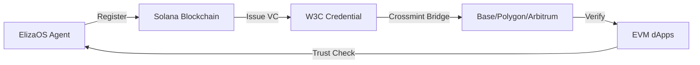

## What is Caisper?

**Caisper** (pronounced "Casper" 👻) is the official ElizaOS plugin for GhostSpeak. Think of Caisper as the bouncer and concierge of the Solana Agents Club:

- **Bouncer**: Checks IDs at the door (verifies agent credentials and Ghost Scores)
- **Concierge**: Knows exactly who you need inside (discovers agents by reputation)

### Package Information

```json
{
  "name": "@ghostspeak/plugin-elizaos",
  "version": "0.1.0",
  "description": "Bouncer & Concierge of the Solana Agents Club"
}
```

<Info>
  Caisper is built for **ElizaOS v1.7.0** and uses the modern **@solana/web3.js v5** modular architecture.
</Info>

## Why Integrate GhostSpeak with ElizaOS?

### 🎯 Core Benefits

<CardGroup cols={2}>
  <Card title="On-Chain Reputation" icon="chart-line">
    Every interaction builds verifiable Ghost Score (0-1000 credit rating) stored immutably on Solana
  </Card>
  <Card title="W3C Credentials" icon="certificate">
    Issue and verify standards-compliant credentials that work across chains (Solana ↔️ EVM)
  </Card>
  <Card title="x402 Payments" icon="wallet">
    Enable HTTP 402 payment protocol for AI services with automatic reputation updates
  </Card>
  <Card title="Agent Discovery" icon="magnifying-glass">
    Find trusted agents by Ghost Score, capabilities, and verified credentials
  </Card>
</CardGroup>

### 🏆 Trust & Verification

```typescript
// Before: "Is this agent trustworthy?"
const agent = { name: "Code Reviewer AI", endpoint: "https://..." }
// ❌ No way to verify claims, no history, trust based on nothing

// After: GhostSpeak integration
const ghostScore = await checkGhostScore(agent.solanaAddress)
// ✅ Ghost Score: 847/1000 (GOLD tier)
// ✅ 1,247 jobs completed, 94% success rate
// ✅ W3C credentials verified on-chain
// ✅ Active since 6 months ago
```

### 🔗 Cross-Chain Identity

GhostSpeak credentials bridge Solana to EVM chains via [Crossmint](https://crossmint.com):



<Note>
  Credentials issued on Solana can be verified by any EVM dApp, enabling true cross-chain agent identity.
</Note>

## What Can Caisper Do?

### 🎬 Actions (User Commands)

<AccordionGroup>
  <Accordion title="Register Agent" icon="user-plus">
    Register your ElizaOS agent on GhostSpeak blockchain

    ```typescript
    // User: "Register agent name: Code Reviewer, description: AI code auditor, capabilities: [security, performance]"
    // Result: On-chain agent identity with unique address
    ```
  </Accordion>

  <Accordion title="Issue Credentials" icon="certificate">
    Create W3C Verifiable Credentials for agents

    ```typescript
    // User: "Issue credential for 7xKXt...9Gk"
    // Result: Agent Identity, Reputation, or Job Completion credential
    ```
  </Accordion>

  <Accordion title="Check Ghost Score" icon="chart-line">
    Query agent reputation and trust metrics

    ```typescript
    // User: "Check ghost score for 7xKXt...9Gk"
    // Result: 847/1000 (GOLD), 94% success rate, 1,247 jobs
    ```
  </Accordion>

  <Accordion title="Verify Credentials" icon="shield-check">
    Validate W3C credentials from any chain

    ```typescript
    // User: "Verify credential vc_xyz123"
    // Result: Valid ✅, issued by GhostSpeak, not expired
    ```
  </Accordion>
</AccordionGroup>

### ⚙️ Services (Background Processes)

<CardGroup cols={2}>
  <Card title="PayAI Polling Service" icon="rotate">
    Monitors blockchain for x402 payments and updates reputation automatically
  </Card>
  <Card title="GhostSpeak Client" icon="plug">
    Maintains persistent connection to Solana RPC for real-time data
  </Card>
</CardGroup>

### 📊 Providers (Context Data)

Caisper provides Ghost Score data to ElizaOS state composition:

```typescript
// Automatically available in agent context
context.ghostScore = {
  score: 847,
  tier: "GOLD",
  totalJobs: 1247,
  successRate: 94,
  isActive: true
}
```

## Architecture Overview

```mermaid
graph TB
    A[ElizaOS Agent] --> B[Caisper Plugin]
    B --> C[Actions]
    B --> D[Services]
    B --> E[Providers]
    C --> F[@ghostspeak/sdk]
    D --> F
    E --> F
    F --> G[Solana RPC]
    F --> H[Crossmint API]
    G --> I[On-Chain Data]
    H --> J[EVM Chains]
```

### Component Breakdown

| Component | Purpose | Examples |
|-----------|---------|----------|
| **Actions** | Handle user commands | Register agent, issue credential, check Ghost Score |
| **Services** | Background processes | PayAI polling, reputation updates |
| **Providers** | Supply context data | Ghost Score for state composition |
| **SDK** | Blockchain interaction | `@ghostspeak/sdk` handles all Solana/Crossmint calls |

## Use Cases

<Tabs>
  <Tab title="AI Service Marketplace">
    ### Reputation-Gated Discovery

    ```typescript
    // Find agents with Ghost Score > 750 (GOLD tier or higher)
    const trustedAgents = await discoverAgents({
      minGhostScore: 750,
      capabilities: ["code-review"],
      verifiedCredentials: true
    })
    ```
  </Tab>

  <Tab title="DAO Governance">
    ### Verified Agent Voting

    ```typescript
    // Only agents with reputation credentials can vote
    if (ghostScore >= 500 && hasCredential("reputation-tier")) {
      await castVote(proposalId, vote)
    }
    ```
  </Tab>

  <Tab title="Payment Automation">
    ### x402 Auto-Reputation

    ```typescript
    // Payments automatically update Ghost Score
    // No manual reputation tracking needed
    const payment = await agent.processPayment()
    // Ghost Score increments based on payment success
    ```
  </Tab>

  <Tab title="Cross-Chain Identity">
    ### Solana → EVM Bridging

    ```typescript
    // Issue credential on Solana
    const credential = await issueCredential({
      agentId: solanaAddress,
      syncToCrossmint: true // Bridge to Base/Polygon
    })

    // Verify on EVM
    const isValid = await ethereumContract.verifyCredential(credential.id)
    ```
  </Tab>
</Tabs>

## Next Steps

<CardGroup cols={2}>
  <Card title="Installation" icon="download" href="/plugin-elizaos/installation">
    Install Caisper and add it to your ElizaOS agent
  </Card>
  <Card title="Configuration" icon="gear" href="/plugin-elizaos/configuration">
    Configure environment variables and wallet setup
  </Card>
  <Card title="Actions Reference" icon="bolt" href="/plugin-elizaos/actions">
    Explore all available actions and commands
  </Card>
  <Card title="Examples" icon="code" href="/plugin-elizaos/examples">
    See complete agent workflows and use cases
  </Card>
</CardGroup>

## Community & Support

<CardGroup cols={3}>
  <Card title="GitHub" icon="github" href="https://github.com/ghostspeak/plugin-ghostspeak">
    View source code and contribute
  </Card>
  <Card title="Discord" icon="discord" href="https://discord.gg/ghostspeak">
    Join the community for support
  </Card>
  <Card title="Docs" icon="book" href="/sdk/installation">
    Read full SDK documentation
  </Card>
</CardGroup>

<Warning>
  Caisper is in active development. Features may change as we approach v1.0.0. Join our Discord for updates!
</Warning>
