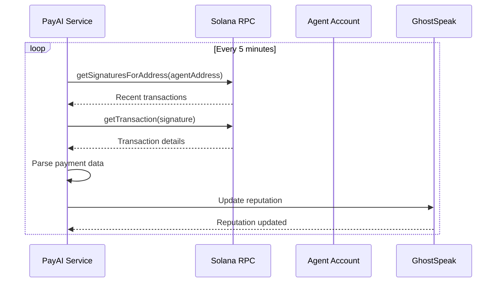

## Overview

Caisper includes **2 background services** that run continuously while your ElizaOS agent is active:

<CardGroup cols={2}>
  <Card title="PayAI Polling Service" icon="rotate">
    Monitors blockchain for x402 payments and updates reputation automatically
  </Card>
  <Card title="Starter Service" icon="plug">
    Template service for custom GhostSpeak integrations
  </Card>
</CardGroup>

<Info>
  Services are long-running background processes. Unlike **Actions** (handle user commands) and **Providers** (supply context data), services perform continuous operations.
</Info>

---

## PayAI Polling Service

### Purpose

The PayAI Polling Service monitors Solana blockchain for x402 payment protocol transactions and automatically updates agent reputation scores.

### How It Works



### Configuration

<ParamField path="pollInterval" type="number" default={300000}>
  Polling interval in milliseconds (default: 5 minutes)

  ```typescript
  // Minimum: 60000 (1 minute)
  // Default: 300000 (5 minutes)
  // Maximum: 3600000 (1 hour)
  ```
</ParamField>

<ParamField path="batchSize" type="number" default={10}>
  Number of transactions to fetch per poll

  ```typescript
  // Minimum: 5
  // Default: 10
  // Maximum: 100
  ```
</ParamField>

<ParamField path="enabled" type="boolean" default={true}>
  Enable/disable service at runtime
</ParamField>

### Service Lifecycle

<Steps>
  <Step title="Initialization">
    Service starts when ElizaOS agent loads Caisper plugin:

    ```typescript
    // Automatic startup
    await PayAIPollingService.start(runtime)

    // Service initialized
    logger.info('PayAI Polling Service started')
    ```
  </Step>

  <Step title="Polling Loop">
    Every 5 minutes (configurable):

    ```typescript
    // 1. Fetch all registered agents
    const agents = await client.agents.getAllAgents()

    // 2. Check payments for each agent
    for (const agent of agents) {
      await checkAgentPayments(agent.address)
    }

    // 3. Process new payments
    await processPayment(paymentRecord)
    ```
  </Step>

  <Step title="Payment Processing">
    For each payment transaction:

    ```typescript
    // Extract payment details
    const payment = {
      signature: "5jHD8z9x...",
      agentAddress: address("7xKXt..."),
      amount: 1_000_000n, // lamports
      payer: address("3zYx..."),
      timestamp: 1234567890,
    }

    // Update reputation (future feature)
    // await updateAgentReputation(payment)

    // Mark as processed
    processedSignatures.add(signature)
    ```
  </Step>

  <Step title="Shutdown">
    Clean shutdown when agent stops:

    ```typescript
    // Stop polling
    clearInterval(intervalId)

    // Clear cache
    processedSignatures.clear()

    logger.info('PayAI Polling Service stopped')
    ```
  </Step>
</Steps>

### Runtime Control

<Tabs>
  <Tab title="Get Service Instance">
    ```typescript
    import type { IAgentRuntime } from '@elizaos/core'
    import { PayAIPollingService } from '@ghostspeak/plugin-elizaos'

    // In action or custom code
    const service = runtime.getService<PayAIPollingService>('payai-polling')

    if (service) {
      const stats = service.getStats()
      console.log('Processed payments:', stats.processedPayments)
    }
    ```
  </Tab>

  <Tab title="Manual Payment Check">
    ```typescript
    import { address } from '@solana/addresses'

    const service = runtime.getService<PayAIPollingService>('payai-polling')

    // Force check for specific agent
    await service.checkPaymentsNow(
      address('7xKXtYZ3rR9vR1xgVfqU8kK4d9gP9Gk')
    )
    ```
  </Tab>

  <Tab title="Get Statistics">
    ```typescript
    const service = runtime.getService<PayAIPollingService>('payai-polling')

    const stats = service.getStats()
    // {
    //   processedPayments: 42,
    //   isPolling: true,
    //   pollInterval: "300s"
    // }
    ```
  </Tab>
</Tabs>

### Error Handling

The service includes robust error handling:

<AccordionGroup>
  <Accordion title="RPC Connection Failures" icon="server">
    **Symptom**: `Failed to connect to RPC`

    **Handling**:
    ```typescript
    try {
      const signatures = await rpc.getSignaturesForAddress(agentAddress).send()
    } catch (error) {
      logger.error({ error, agentAddress }, 'Failed to fetch signatures')
      // Service continues, will retry next poll cycle
    }
    ```

    Service logs error and continues polling (doesn't crash).
  </Accordion>

  <Accordion title="Transaction Parsing Errors" icon="file-code">
    **Symptom**: `Failed to parse transaction`

    **Handling**:
    ```typescript
    if (!transaction || transaction.meta?.err) {
      // Skip failed transaction
      continue
    }
    ```

    Failed transactions are skipped, not reprocessed.
  </Accordion>

  <Accordion title="Rate Limiting" icon="gauge-high">
    **Symptom**: `429 Too Many Requests`

    **Handling**:
    - Service uses 5-minute intervals by default (well below rate limits)
    - Batch size limited to 10 transactions per agent
    - Use premium RPC endpoint for production

    ```bash filename=".env"
    # Use Helius/QuickNode for higher limits
    SOLANA_RPC_URL=https://mainnet.helius-rpc.com/?api-key=YOUR_KEY
    ```
  </Accordion>
</AccordionGroup>

### Monitoring

Enable debug logging to monitor service activity:

```bash
# Start with debug logs
LOG_LEVEL=debug elizaos dev

# Watch for polling activity:
# [PayAI] Polling for new payments...
# [PayAI] Checking payments for 15 agents
# [PayAI] Found 3 new payments
# [PayAI] Processing payment: 5jHD8z9x...
# [PayAI] Payment polling complete
```

### API Endpoints

The service exposes monitoring endpoints:

<CodeGroup>

```bash GET /api/payai/stats
curl http://localhost:3000/api/payai/stats
```

```json Response
{
  "service": "payai-polling",
  "status": "active",
  "stats": {
    "processedPayments": 42,
    "isPolling": true,
    "pollInterval": "300s",
    "lastPollTime": "2025-12-31T12:34:56Z",
    "nextPollTime": "2025-12-31T12:39:56Z"
  }
}
```

</CodeGroup>

---

## Starter Service

### Purpose

Template service for custom GhostSpeak integrations. Demonstrates service structure and lifecycle.

### Usage

```typescript
import { StarterService } from '@ghostspeak/plugin-elizaos'

// Service auto-starts with plugin
// Access via runtime
const service = runtime.getService<StarterService>('starter')

console.log(service.capabilityDescription)
// "This is a starter service which is attached to the agent through the starter plugin."
```

### Extend for Custom Services

Create your own GhostSpeak services:

```typescript filename="src/services/CustomGhostSpeakService.ts"
import { Service, logger } from '@elizaos/core'
import type { IAgentRuntime } from '@elizaos/core'
import { GhostSpeakClient } from '@ghostspeak/sdk'

export class CustomGhostSpeakService extends Service {
  static serviceType = 'custom-ghostspeak'

  capabilityDescription = 'Custom GhostSpeak integration service'

  private client: GhostSpeakClient
  private intervalId: NodeJS.Timeout | null = null

  constructor(protected runtime: IAgentRuntime) {
    super(runtime)

    this.client = new GhostSpeakClient({
      cluster: process.env.SOLANA_CLUSTER as any || 'devnet',
      rpcEndpoint: process.env.SOLANA_RPC_URL,
    })
  }

  static async start(runtime: IAgentRuntime) {
    logger.info('Starting Custom GhostSpeak Service')
    const service = new CustomGhostSpeakService(runtime)
    await service.initialize()
    return service
  }

  static async stop(runtime: IAgentRuntime) {
    const service = runtime.getService(CustomGhostSpeakService.serviceType)
    if (service) {
      await (service as CustomGhostSpeakService).shutdown()
    }
  }

  async initialize() {
    // Your initialization logic
    logger.info('Custom GhostSpeak Service initialized')

    // Start background task
    this.intervalId = setInterval(() => {
      this.performTask()
    }, 60000) // Every minute
  }

  async stop() {
    await this.shutdown()
  }

  private async shutdown() {
    if (this.intervalId) {
      clearInterval(this.intervalId)
      this.intervalId = null
    }
    logger.info('Custom GhostSpeak Service stopped')
  }

  private async performTask() {
    try {
      // Your custom GhostSpeak logic
      const agents = await this.client.agents.getAllAgents()
      logger.debug(`Found ${agents.length} agents`)

      // Example: Update agent metadata
      // Example: Sync with external system
      // Example: Generate reports
    } catch (error) {
      logger.error({ error }, 'Task failed')
    }
  }
}
```

Register custom service:

```typescript filename="src/index.ts"
import { starterPlugin } from '@ghostspeak/plugin-elizaos'
import { CustomGhostSpeakService } from './services/CustomGhostSpeakService'

const agent = await createAgent({
  plugins: [
    {
      ...starterPlugin,
      services: [...starterPlugin.services, CustomGhostSpeakService],
    },
  ],
})
```

---

## Service Best Practices

### 1. Resource Management

```typescript
export class MyService extends Service {
  private client: GhostSpeakClient | null = null
  private intervalId: NodeJS.Timeout | null = null

  async initialize() {
    this.client = new GhostSpeakClient({ cluster: 'devnet' })
    this.intervalId = setInterval(() => this.task(), 60000)
  }

  async shutdown() {
    // Clean up resources!
    if (this.intervalId) {
      clearInterval(this.intervalId)
      this.intervalId = null
    }
    this.client = null
  }
}
```

<Warning>
  Always clean up resources in `shutdown()`. Leaked intervals/connections can cause memory issues.
</Warning>

### 2. Error Recovery

```typescript
private async performTask() {
  try {
    await this.client.someOperation()
  } catch (error) {
    logger.error({ error }, 'Task failed')
    // DON'T crash the service!
    // Continue to next iteration
  }
}
```

### 3. Graceful Degradation

```typescript
async initialize() {
  try {
    this.client = new GhostSpeakClient({ cluster: 'devnet' })
    logger.info('Service initialized successfully')
  } catch (error) {
    logger.warn({ error }, 'Service initialization failed')
    // Service continues in degraded mode
    this.client = null
  }
}

private async performTask() {
  if (!this.client) {
    logger.debug('Service not initialized, skipping task')
    return
  }
  // Perform task...
}
```

### 4. Monitoring & Observability

```typescript
export class MonitoredService extends Service {
  private metrics = {
    tasksRun: 0,
    errors: 0,
    lastRunTime: 0,
  }

  getStats() {
    return {
      ...this.metrics,
      uptime: Date.now() - this.startTime,
      isHealthy: this.metrics.errors < 10,
    }
  }

  private async performTask() {
    const startTime = Date.now()
    try {
      await this.doWork()
      this.metrics.tasksRun++
    } catch (error) {
      this.metrics.errors++
      logger.error({ error }, 'Task failed')
    } finally {
      this.metrics.lastRunTime = Date.now() - startTime
    }
  }
}
```

### 5. Configuration Validation

```typescript
import { z } from 'zod'

const serviceConfigSchema = z.object({
  pollInterval: z.number().min(60000).max(3600000),
  batchSize: z.number().min(1).max(100),
  enabled: z.boolean(),
})

export class ConfiguredService extends Service {
  private config: z.infer<typeof serviceConfigSchema>

  async initialize() {
    // Validate config
    this.config = serviceConfigSchema.parse({
      pollInterval: Number(process.env.POLL_INTERVAL) || 300000,
      batchSize: Number(process.env.BATCH_SIZE) || 10,
      enabled: process.env.SERVICE_ENABLED !== 'false',
    })

    logger.info({ config: this.config }, 'Service configured')
  }
}
```

---

## Service Communication

Services can communicate via runtime state:

```typescript
// Service A writes data
export class ProducerService extends Service {
  async performTask() {
    const data = await this.fetchData()
    await this.runtime.setState('ghostspeak:data', data)
  }
}

// Service B reads data
export class ConsumerService extends Service {
  async performTask() {
    const data = await this.runtime.getState('ghostspeak:data')
    if (data) {
      await this.processData(data)
    }
  }
}
```

<Info>
  Use namespaced keys (e.g., `ghostspeak:*`) to avoid conflicts with other plugins.
</Info>

---

## Debugging Services

### Enable Service Logs

```bash
# Debug logs
LOG_LEVEL=debug elizaos dev

# Watch specific service
LOG_LEVEL=debug elizaos dev 2>&1 | grep "PayAI"
```

### Inspect Service State

```typescript
// In ElizaOS console or custom action
const service = runtime.getService('payai-polling')

console.log('Service type:', service.serviceType)
console.log('Capability:', service.capabilityDescription)
console.log('Stats:', service.getStats())
```

### Health Check Endpoint

Create a health check route:

```typescript
{
  name: 'service-health',
  path: '/api/services/health',
  type: 'GET',
  handler: async (req, res) => {
    const payaiService = runtime.getService('payai-polling')
    const starterService = runtime.getService('starter')

    res.json({
      services: {
        'payai-polling': payaiService ? 'active' : 'inactive',
        'starter': starterService ? 'active' : 'inactive',
      },
      stats: {
        payai: payaiService?.getStats() || null,
      }
    })
  }
}
```

Test:

```bash
curl http://localhost:3000/api/services/health
```

---

## Next Steps

<CardGroup cols={2}>
  <Card title="Examples" icon="code" href="/plugin-elizaos/examples">
    See complete agent workflows using services
  </Card>
  <Card title="SDK Reference" icon="book" href="/sdk/agents">
    Deep dive into GhostSpeak SDK
  </Card>
  <Card title="API Reference" icon="brackets-curly" href="/api/endpoints/agents">
    Explore REST API endpoints
  </Card>
  <Card title="Troubleshooting" icon="wrench" href="/resources/troubleshooting">
    Common service issues and solutions
  </Card>
</CardGroup>
