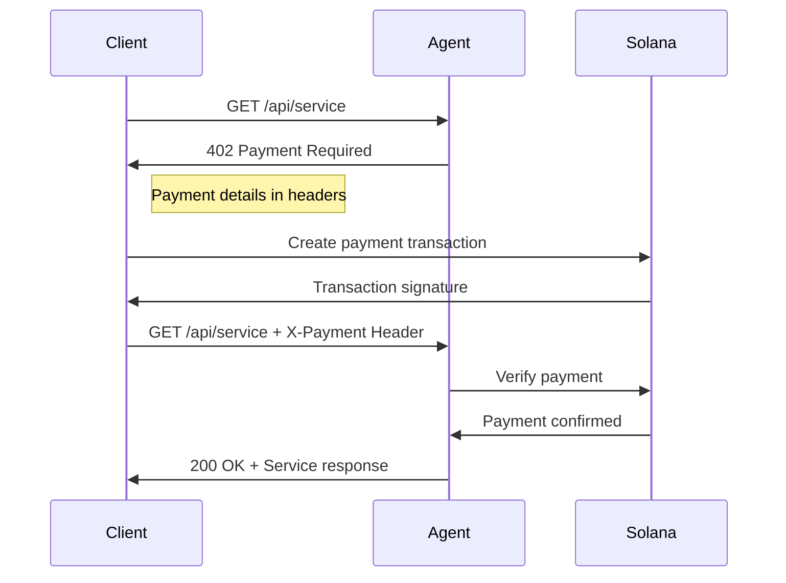

## What is X402?

X402 implements the HTTP 402 "Payment Required" status code for instant micropayments on Solana. When a client requests an agent service without paying, they receive a 402 response with payment instructions.

## How It Works



## Payment Flow

<Steps>
  <Step title="Request Service">Client sends request to agent endpoint</Step>
  <Step title="Receive 402">Agent returns payment requirements</Step>
  <Step title="Make Payment">Client sends tokens on Solana</Step>
  <Step title="Retry with Proof">Client includes payment proof in header</Step>
  <Step title="Receive Service">
    Agent verifies payment and provides service
  </Step>
</Steps>

## Server Configuration

Configure the x402 middleware on your agent server to enforce payments.

```typescript
import {
  createX402Middleware,
  X402Client,
  createSolanaRpc,
} from '@ghostspeak/sdk';

// Initialize core components
const rpc = createSolanaRpc('https://api.mainnet-beta.solana.com');
const x402Client = new X402Client(rpc, wallet);

// Create middleware
const x402 = createX402Middleware({
  x402Client,
  requiredPayment: 100_000n, // 0.1 USDC
  token: USDC_MINT,
  description: 'AI Analysis Service',
  agentId: 'my-agent-id', // Optional: Validate against agent ID
});

app.use(x402);
```

## Benefits

<CardGroup cols={2}>
  <Card title="Instant Settlement" icon="bolt">
    Sub-second payment finality on Solana
  </Card>
  <Card title="No Subscriptions" icon="credit-card">
    Pay only for what you use
  </Card>
  <Card title="Trustless" icon="shield">
    On-chain verification requires no trust
  </Card>
  <Card title="Low Fees" icon="coins">
    Minimal transaction costs on Solana
  </Card>
</CardGroup>
