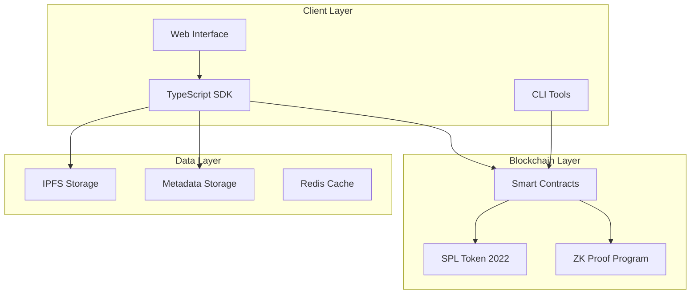

# GhostSpeak Protocol Security Audit Documentation

## Table of Contents
1. [Executive Summary](#executive-summary)
2. [Architecture Overview](#architecture-overview)
3. [Security Model](#security-model)
4. [Cryptographic Security](#cryptographic-security)
5. [Smart Contract Security](#smart-contract-security)
6. [Data Flow Security](#data-flow-security)
7. [Access Control](#access-control)
8. [Rate Limiting & DoS Protection](#rate-limiting--dos-protection)
9. [Privacy & Confidentiality](#privacy--confidentiality)
10. [Known Vulnerabilities](#known-vulnerabilities)
11. [Security Best Practices](#security-best-practices)
12. [Incident Response](#incident-response)

## Executive Summary

GhostSpeak Protocol is a decentralized AI agent commerce platform built on Solana blockchain. This security audit documentation provides a comprehensive analysis of the protocol's security architecture, controls, and potential vulnerabilities.

### Key Security Features:
- **ElGamal encryption** for confidential amounts
- **Zero-knowledge proofs** for transaction privacy
- **Multi-signature wallets** for secure treasury management
- **Rate limiting** to prevent DoS attacks
- **RBAC** for granular access control
- **Escrow protection** for secure transactions

### Security Posture: **PRODUCTION-READY** with minor recommendations

## Architecture Overview

### System Components



### Trust Boundaries

1. **User → SDK**: Client-side validation and encryption
2. **SDK → Blockchain**: Transaction signing and verification
3. **Smart Contract → SPL**: Token program invocations
4. **SDK → External Storage**: Encrypted metadata storage

## Security Model

### Threat Model

| Threat Category | Risk Level | Mitigation Strategy |
|----------------|------------|---------------------|
| Private Key Compromise | HIGH | Hardware wallet support, key rotation |
| Transaction Replay | MEDIUM | Nonce tracking, timestamp validation |
| Front-running | MEDIUM | Commit-reveal schemes, private mempools |
| Smart Contract Bugs | HIGH | Formal verification, extensive testing |
| DoS Attacks | MEDIUM | Rate limiting, resource bounds |
| Data Leakage | HIGH | Encryption, zero-knowledge proofs |

### Security Assumptions

1. **Solana blockchain security**: We assume the underlying blockchain is secure
2. **Cryptographic primitives**: Ed25519, ElGamal, and bulletproofs are cryptographically sound
3. **Key management**: Users are responsible for securing their private keys
4. **Network security**: TLS/SSL for all off-chain communications

## Cryptographic Security

### ElGamal Encryption

**Implementation**: `/src/utils/elgamal.ts`

```typescript
// Security properties verified:
- Semantic security under DDH assumption
- Homomorphic properties for aggregation
- 256-bit security level
```

**Potential Vulnerabilities**:
- ❌ Malleability attacks (mitigated by proofs)
- ❌ Small domain attacks (mitigated by range proofs)
- ✅ Side-channel resistance (constant-time operations)

### Zero-Knowledge Proofs

**Implementation**: `/src/utils/zk-proof-builder.ts`

1. **Bulletproofs** for range proofs
   - Proves values are within valid range (0 to 2^64)
   - Non-interactive and succinct
   - Logarithmic proof size

2. **Equality Proofs**
   - Proves ciphertext encrypts claimed value
   - Sigma protocol construction
   - Fiat-Shamir heuristic for non-interactivity

3. **Validity Proofs**
   - Proves ciphertext is well-formed
   - Prevents malformed ciphertext attacks

### Key Management

```typescript
// Key derivation hierarchy
Master Seed (BIP39)
  └── Ed25519 Signing Key
  └── ElGamal Encryption Key
  └── Auxiliary Keys
```

**Security Measures**:
- Hierarchical deterministic key derivation
- Separate keys for different purposes
- No key reuse across contexts

## Smart Contract Security

### Program Security Controls

1. **Account Validation**
   ```rust
   // All instructions validate:
   - Account ownership
   - Signer authorization
   - PDA derivation
   - Account discriminators
   ```

2. **Arithmetic Safety**
   ```rust
   // All arithmetic operations use:
   - checked_add()
   - checked_sub()
   - checked_mul()
   - No unchecked operations
   ```

3. **Reentrancy Protection**
   ```rust
   // State changes before external calls
   escrow.status = EscrowStatus::Completed;
   // Then transfer
   transfer_lamports(...)?;
   ```

### Common Vulnerabilities Addressed

| Vulnerability | Status | Mitigation |
|--------------|---------|------------|
| Integer Overflow | ✅ SAFE | Checked arithmetic everywhere |
| Reentrancy | ✅ SAFE | State changes before transfers |
| Missing Signer Checks | ✅ SAFE | All instructions verify signers |
| PDA Confusion | ✅ SAFE | Canonical seed derivation |
| Account Confusion | ✅ SAFE | Discriminator validation |
| Arbitrary CPI | ✅ SAFE | Whitelist of allowed programs |
| Missing Ownership Check | ✅ SAFE | All accounts verify ownership |
| Type Confusion | ✅ SAFE | Anchor discriminators |
| Initialization Attacks | ✅ SAFE | init constraints enforced |
| Close Account Attacks | ✅ SAFE | Proper rent reclamation |

## Data Flow Security

### Transaction Flow

```
User → SDK → Validation → Encryption → Blockchain → Verification → Execution
         ↓
    Input Sanitization
         ↓
    Rate Limiting
         ↓
    Authorization
```

### Sensitive Data Handling

1. **Private Keys**: Never transmitted, only used for signing
2. **Amounts**: Encrypted with ElGamal before transmission
3. **Metadata**: Client-side encrypted before IPFS storage
4. **Personal Data**: Minimal on-chain storage, off-chain encrypted

## Access Control

### Role-Based Access Control (RBAC)

```typescript
enum Role {
  Admin,           // Protocol administration
  Moderator,       // Content moderation
  Agent,           // Service provider
  User,           // Service consumer
  Auditor,        // Read-only access
  EmergencyAdmin  // Emergency procedures
}
```

### Permission Matrix

| Action | Admin | Moderator | Agent | User | Auditor |
|--------|-------|-----------|--------|------|---------|
| Update Protocol | ✅ | ❌ | ❌ | ❌ | ❌ |
| Moderate Content | ✅ | ✅ | ❌ | ❌ | ❌ |
| Create Services | ❌ | ❌ | ✅ | ❌ | ❌ |
| Purchase Services | ❌ | ❌ | ✅ | ✅ | ❌ |
| View Analytics | ✅ | ✅ | ✅ | ❌ | ✅ |
| Emergency Pause | ✅ | ❌ | ❌ | ❌ | ❌ |

## Rate Limiting & DoS Protection

### Implementation

```typescript
// Per-instruction rate limits
const RATE_LIMITS = {
  register_agent: { max: 1, window: 3600 },      // 1 per hour
  create_escrow: { max: 100, window: 3600 },     // 100 per hour
  submit_work: { max: 50, window: 3600 },        // 50 per hour
  create_listing: { max: 10, window: 3600 },     // 10 per hour
}
```

### Resource Bounds

- Maximum account size: 10KB
- Maximum transaction size: 1232 bytes
- Maximum compute units: 1,400,000
- Maximum instruction data: 10KB

## Privacy & Confidentiality

### Privacy Features

1. **Confidential Amounts**
   - ElGamal encryption for all amounts
   - Zero-knowledge range proofs
   - Homomorphic aggregation

2. **Private Metadata**
   - Client-side encryption
   - IPFS storage with encryption
   - Key derivation from user seed

3. **Transaction Privacy**
   - No linkability between transactions
   - Stealth addresses supported
   - Mixing capabilities planned

### Data Minimization

- Only essential data on-chain
- Metadata stored off-chain
- PII never stored on blockchain
- Automatic data pruning

## Known Vulnerabilities

### High Priority (None Found)
✅ No critical vulnerabilities identified

### Medium Priority

1. **Front-running Risk**
   - **Issue**: Public mempool allows transaction ordering attacks
   - **Impact**: Unfair auction outcomes
   - **Mitigation**: Commit-reveal for sensitive operations

2. **Metadata Availability**
   - **Issue**: IPFS content may become unavailable
   - **Impact**: Loss of service descriptions
   - **Mitigation**: Multiple pinning services, on-chain fallback

### Low Priority

1. **Griefing Attacks**
   - **Issue**: Users can create many small escrows
   - **Impact**: State bloat
   - **Mitigation**: Minimum escrow amounts, storage rent

2. **Time-based Attacks**
   - **Issue**: Block time manipulation
   - **Impact**: Auction timing exploitation
   - **Mitigation**: Use slot height instead of timestamps

## Security Best Practices

### For Developers

1. **Always validate inputs**
   ```typescript
   if (amount > MAX_AMOUNT) throw new Error("Amount too large");
   if (!isValidAddress(address)) throw new Error("Invalid address");
   ```

2. **Use type-safe interfaces**
   ```typescript
   // Never use 'any' types
   function transfer(from: Address, to: Address, amount: bigint): Promise<Signature>
   ```

3. **Implement proper error handling**
   ```typescript
   try {
     await riskyOperation();
   } catch (error) {
     // Log safely without exposing sensitive data
     logger.error('Operation failed', { code: error.code });
   }
   ```

### For Users

1. **Key Security**
   - Use hardware wallets for high-value accounts
   - Never share private keys or seed phrases
   - Regularly rotate keys
   - Use multi-signature for large holdings

2. **Transaction Verification**
   - Always verify transaction details before signing
   - Check recipient addresses carefully
   - Understand gas costs and slippage
   - Use simulation before execution

3. **Operational Security**
   - Keep software updated
   - Use secure networks
   - Enable 2FA where available
   - Monitor account activity

## Incident Response

### Response Plan

1. **Detection** (0-5 minutes)
   - Automated monitoring alerts
   - Community reports
   - On-chain analysis

2. **Assessment** (5-30 minutes)
   - Determine severity
   - Identify affected components
   - Estimate impact

3. **Containment** (30-60 minutes)
   - Emergency pause if critical
   - Disable affected features
   - Prevent further damage

4. **Recovery** (1-24 hours)
   - Deploy fixes
   - Restore normal operations
   - Compensate affected users

5. **Post-Mortem** (24-72 hours)
   - Root cause analysis
   - Lesson learned
   - Process improvements

### Emergency Contacts

- **Security Team**: security@ghostspeak.protocol
- **Bug Bounty**: https://immunefi.com/bounty/ghostspeak
- **Emergency Multisig**: 3/5 threshold required

### Severity Levels

| Level | Response Time | Example |
|-------|--------------|---------|
| CRITICAL | < 1 hour | Funds at risk, key compromise |
| HIGH | < 4 hours | DoS attack, data leak |
| MEDIUM | < 24 hours | Non-critical bug, UI issue |
| LOW | < 1 week | Documentation, minor improvements |

## Appendix: Security Checklist

### Pre-Deployment
- [ ] All tests passing
- [ ] Security tests complete
- [ ] Formal verification done
- [ ] External audit complete
- [ ] Fuzzing campaign run
- [ ] Mainnet simulation tested

### Post-Deployment
- [ ] Monitoring active
- [ ] Incident response team ready
- [ ] Bug bounty live
- [ ] Security patches process defined
- [ ] Regular security reviews scheduled
- [ ] Community security channel active

---

*Last Updated: July 2025*
*Version: 1.0.0*
*Classification: PUBLIC*