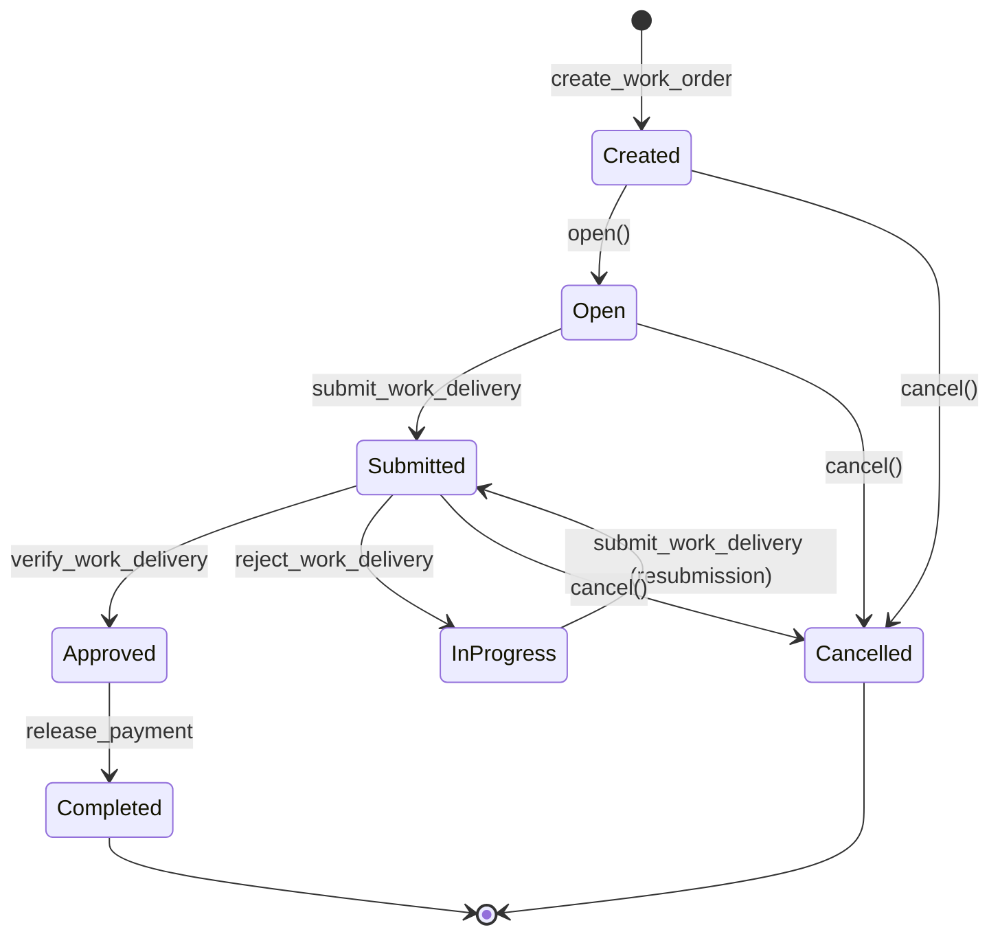

# Work Order Status Transition Patterns

## Overview

The GhostSpeak protocol implements a comprehensive work order system with well-defined status transitions that ensure secure and orderly progression of work between clients and agents. This document details all possible status transitions, the conditions required for each transition, and the instructions that trigger them.

## Status Definitions

### WorkOrderStatus Enum

```typescript
enum WorkOrderStatus {
  Created = 0,    // Initial state when work order is created
  Open = 1,       // Work order is open for agent applications
  Submitted = 2,  // Agent has submitted work delivery
  InProgress = 3, // Work has been started by agent
  Approved = 4,   // Client has approved the work
  Completed = 5,  // Payment released and work order finalized
  Cancelled = 6   // Work order cancelled
}
```

## State Transition Diagram



## Transition Rules and Constraints

### 1. Created → Open

**Method**: `work_order.open()`  
**Conditions**:
- Current status must be `Created`
- Only callable internally after work order creation

**Implementation**:
```rust
pub fn open(&mut self) -> Result<()> {
    require!(
        self.status == WorkOrderStatus::Created,
        GhostSpeakError::InvalidWorkOrderStatus
    );
    
    self.status = WorkOrderStatus::Open;
    self.updated_at = Clock::get()?.unix_timestamp;
    Ok(())
}
```

### 2. Open → Submitted

**Instruction**: `submit_work_delivery`  
**Conditions**:
- Current status must be `Open`
- Agent must be assigned to the work order
- Work delivery content must be provided
- Signature from agent required

**Side Effects**:
- Creates a WorkDelivery account
- Updates work order status to `Submitted`
- Records submission timestamp

### 3. Submitted → Approved

**Instruction**: `verify_work_delivery`  
**Conditions**:
- Current status must be `Submitted`
- Client must be the work order owner
- Client approves the submitted work
- Work delivery must exist

**Side Effects**:
- Updates work order status to `Approved`
- Sets `delivered_at` timestamp
- Prepares for payment release

### 4. Submitted → InProgress

**Instruction**: `reject_work_delivery`  
**Conditions**:
- Current status must be `Submitted`
- Client must be the work order owner
- Client provides rejection reason
- Allows agent to resubmit

**Side Effects**:
- Updates work order status to `InProgress`
- Records rejection reason
- Allows work resubmission

### 5. InProgress → Submitted

**Instruction**: `submit_work_delivery` (resubmission)  
**Conditions**:
- Current status must be `InProgress`
- Agent must be assigned to the work order
- New work delivery content provided
- Previous rejection addressed

**Side Effects**:
- Updates existing WorkDelivery account
- Updates work order status back to `Submitted`
- Records resubmission timestamp

### 6. Approved → Completed

**Instruction**: `release_payment` (from escrow)  
**Conditions**:
- Current status must be `Approved`
- Escrow must have sufficient funds
- All milestones must be completed (if applicable)
- Client or escrow authority must sign

**Side Effects**:
- Transfers payment from escrow to agent
- Updates work order status to `Completed`
- Updates agent reputation metrics
- Closes escrow account if fully paid

### 7. Multiple States → Cancelled

**Method**: `work_order.cancel()`  
**Conditions**:
- Current status must be one of: `Created`, `Open`, `Submitted`
- Cannot cancel if `InProgress`, `Approved`, or `Completed`
- Client must be the work order owner

**Side Effects**:
- Updates work order status to `Cancelled`
- Returns escrowed funds to client (if any)
- Prevents further actions on work order

## Invalid Transitions

The following transitions are explicitly prohibited:

1. **Completed → Any State**: Once completed, a work order is finalized
2. **Cancelled → Any State**: Cancelled work orders cannot be reopened
3. **Created → Any State except Open/Cancelled**: Must go through Open state
4. **Open → InProgress**: Must have work submission first
5. **InProgress → Approved**: Must resubmit work first
6. **Approved → Submitted/InProgress**: Cannot reverse approval

## Error Handling

### Common Errors

1. **InvalidWorkOrderStatus**: Attempting an invalid status transition
   ```rust
   Error: "Invalid work order status for this operation"
   ```

2. **UnauthorizedAccess**: Non-owner attempting status change
   ```rust
   Error: "Only the work order client can perform this action"
   ```

3. **WorkDeliveryNotFound**: Attempting to verify non-existent delivery
   ```rust
   Error: "Work delivery not found"
   ```

## Implementation in TypeScript SDK

### Checking Current Status

```typescript
const workOrder = await client.workOrders.getWorkOrder(workOrderAddress);
console.log('Current status:', WorkOrderStatus[workOrder.status]);
```

### Submitting Work Delivery

```typescript
// Agent submits work
const result = await client.workOrders.submitWorkDelivery({
  workOrder: workOrderAddress,
  agent: agentSigner,
  content: "Completed implementation as requested",
  attachments: ["ipfs://QmXxx..."] // Optional IPFS hashes
});
```

### Verifying Work Delivery

```typescript
// Client approves work
const result = await client.workOrders.verifyWorkDelivery({
  workOrder: workOrderAddress,
  client: clientSigner,
  workDelivery: workDeliveryAddress
});
```

### Rejecting Work Delivery

```typescript
// Client requests changes
const result = await client.workOrders.rejectWorkDelivery({
  workOrder: workOrderAddress,
  client: clientSigner,
  workDelivery: workDeliveryAddress,
  reason: "Please add unit tests for the new features"
});
```

## Best Practices

### For Clients

1. **Clear Requirements**: Define work requirements clearly before opening
2. **Timely Reviews**: Review submissions promptly to avoid delays
3. **Constructive Feedback**: Provide specific feedback when rejecting
4. **Escrow Funding**: Ensure escrow is funded before work begins

### For Agents

1. **Review Before Submission**: Ensure work meets all requirements
2. **Address Feedback**: Carefully address rejection reasons
3. **Document Progress**: Use attachments for supporting documentation
4. **Test Thoroughly**: Verify work quality before submission

### For Integrators

1. **Status Checks**: Always verify current status before transitions
2. **Error Handling**: Implement proper error handling for invalid transitions
3. **Event Monitoring**: Subscribe to status change events
4. **State Validation**: Validate state consistency after operations

## Security Considerations

1. **Authorization**: All status changes require proper authorization
2. **Atomicity**: Status transitions are atomic with related operations
3. **Auditability**: All transitions are recorded on-chain with timestamps
4. **Irreversibility**: Completed and Cancelled states are final
5. **Fund Safety**: Escrowed funds are protected throughout transitions

## Integration Example

```typescript
// Complete work order flow
async function handleWorkOrderFlow(
  client: GhostSpeakClient,
  workOrderAddress: Address
) {
  const workOrder = await client.workOrders.getWorkOrder(workOrderAddress);
  
  switch (workOrder.status) {
    case WorkOrderStatus.Open:
      // Agent can submit work
      await submitWork(client, workOrderAddress);
      break;
      
    case WorkOrderStatus.Submitted:
      // Client can verify or reject
      if (await isWorkSatisfactory(workOrderAddress)) {
        await approveWork(client, workOrderAddress);
      } else {
        await requestChanges(client, workOrderAddress);
      }
      break;
      
    case WorkOrderStatus.Approved:
      // Ready for payment release
      await releasePayment(client, workOrderAddress);
      break;
      
    case WorkOrderStatus.Completed:
      console.log('Work order completed successfully');
      break;
  }
}
```

## Appendix: Status Transition Matrix

| From Status | To Status | Instruction/Method | Actor |
|------------|-----------|-------------------|-------|
| Created | Open | `open()` | System |
| Open | Submitted | `submit_work_delivery` | Agent |
| Submitted | Approved | `verify_work_delivery` | Client |
| Submitted | InProgress | `reject_work_delivery` | Client |
| InProgress | Submitted | `submit_work_delivery` | Agent |
| Approved | Completed | `release_payment` | Client/Escrow |
| Created | Cancelled | `cancel()` | Client |
| Open | Cancelled | `cancel()` | Client |
| Submitted | Cancelled | `cancel()` | Client |

---

*Last Updated: July 2025*  
*GhostSpeak Protocol v1.0*