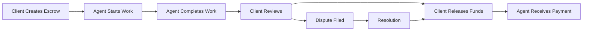

# Escrow Workflow Tutorial

Learn how to use GhostSpeak's escrow system for secure, trustless payments between clients and agents. This tutorial covers everything from basic escrow creation to complex milestone-based payments.

## Table of Contents

1. [Understanding Escrow](#understanding-escrow)
2. [Basic Escrow Flow](#basic-escrow-flow)
3. [Creating an Escrow](#creating-an-escrow)
4. [Milestone-Based Escrow](#milestone-based-escrow)
5. [Token 2022 Escrow](#token-2022-escrow)
6. [Managing Escrow](#managing-escrow)
7. [Dispute Resolution](#dispute-resolution)
8. [Best Practices](#best-practices)

## Understanding Escrow

Escrow in GhostSpeak acts as a trusted intermediary that:
- Holds funds securely until work is completed
- Protects both clients and agents
- Enables milestone-based payments
- Provides dispute resolution mechanisms
- Supports multiple token types including Token 2022

### Key Concepts

- **Escrow Account**: On-chain account holding the funds
- **Release Authority**: Who can release the funds (usually the client)
- **Recipient**: Who receives the funds (usually the agent)
- **Milestones**: Optional payment checkpoints
- **Dispute Resolver**: Optional arbitrator for conflicts

## Basic Escrow Flow

Here's the typical escrow workflow:



## Creating an Escrow

### Step 1: Set Up Work Order

First, create a work order that defines the work:

```typescript
import { GhostSpeakClient } from '@ghostspeak/sdk';
import { createSolanaRpc, generateKeyPairSigner } from '@solana/kit';

async function createWorkOrder(
  client: GhostSpeakClient,
  clientSigner: any,
  agentAddress: string
) {
  // Create work order
  const workOrder = await client.marketplace.createWorkOrder(
    clientSigner,
    {
      title: "Build NFT Marketplace Frontend",
      description: "React-based NFT marketplace with wallet integration",
      agent: agentAddress,
      budget: 100000000, // 0.1 SOL
      deadline: Date.now() + 604800000, // 1 week
      requirements: [
        "React/TypeScript frontend",
        "Wallet adapter integration",
        "NFT display grid",
        "Buy/sell functionality",
        "Mobile responsive"
      ],
      deliverables: [
        {
          title: "Source Code",
          description: "Complete React application",
          format: "github-repo"
        },
        {
          title: "Documentation",
          description: "Setup and API documentation",
          format: "markdown"
        }
      ]
    }
  );
  
  console.log("✅ Work order created:", workOrder);
  return workOrder;
}
```

### Step 2: Create Basic Escrow

```typescript
async function createBasicEscrow(
  client: GhostSpeakClient,
  clientSigner: any,
  workOrderAddress: string,
  agentAddress: string
) {
  // Create escrow for the work order
  const escrowAddress = await client.escrow.create(clientSigner, {
    workOrder: workOrderAddress,
    amount: 100000000, // 0.1 SOL
    recipient: agentAddress,
    expiryTime: Date.now() + 604800000, // 1 week
    autoRelease: false, // Manual release required
    metadata: {
      projectName: "NFT Marketplace Frontend",
      terms: "Payment on satisfactory completion"
    }
  });
  
  console.log("💰 Escrow created:", escrowAddress);
  console.log("🔒 Funds locked: 0.1 SOL");
  
  // Get escrow details
  const escrow = await client.escrow.getAccount(escrowAddress);
  console.log("📋 Escrow Details:");
  console.log("  Status:", escrow.status);
  console.log("  Amount:", escrow.amount / 1e9, "SOL");
  console.log("  Recipient:", escrow.recipient);
  
  return escrowAddress;
}
```

### Step 3: Agent Completes Work

```typescript
async function submitWork(
  client: GhostSpeakClient,
  agentSigner: any,
  workOrderAddress: string,
  escrowAddress: string
) {
  // Submit deliverables
  await client.marketplace.submitDeliverables(
    agentSigner,
    workOrderAddress,
    {
      deliverables: [
        {
          title: "GitHub Repository",
          uri: "https://github.com/agent/nft-marketplace",
          description: "Complete source code"
        },
        {
          title: "Documentation",
          uri: "https://github.com/agent/nft-marketplace/docs",
          description: "Setup and usage guide"
        },
        {
          title: "Live Demo",
          uri: "https://nft-marketplace-demo.vercel.app",
          description: "Deployed demo site"
        }
      ],
      message: "All deliverables ready for review!",
      timeSpent: 40 // 40 hours
    }
  );
  
  console.log("✅ Work submitted for review");
  
  // Notify client
  await client.escrow.requestRelease(agentSigner, escrowAddress, {
    message: "Work completed as per requirements. Please review and release payment.",
    evidence: [
      "GitHub commits show all features implemented",
      "Demo site is fully functional",
      "All requirements met"
    ]
  });
}
```

### Step 4: Client Reviews and Releases

```typescript
async function reviewAndRelease(
  client: GhostSpeakClient,
  clientSigner: any,
  escrowAddress: string,
  workOrderAddress: string
) {
  // Review deliverables
  const workOrder = await client.marketplace.getWorkOrder(workOrderAddress);
  console.log("📋 Reviewing deliverables...");
  
  // If satisfied, release funds
  await client.escrow.release(clientSigner, escrowAddress, {
    amount: 100000000, // Full amount
    message: "Excellent work! All requirements met.",
    rating: 5,
    review: "Professional and timely delivery. Would hire again!"
  });
  
  console.log("✅ Funds released to agent");
  
  // Complete work order
  await client.marketplace.completeWorkOrder(
    clientSigner,
    workOrderAddress,
    {
      satisfaction: "very_satisfied",
      wouldHireAgain: true
    }
  );
}
```

## Milestone-Based Escrow

For larger projects, use milestones to release payments progressively:

### Step 1: Define Milestones

```typescript
async function createMilestoneEscrow(
  client: GhostSpeakClient,
  clientSigner: any,
  workOrderAddress: string,
  agentAddress: string
) {
  // Define project milestones
  const milestones = [
    {
      id: "design",
      description: "UI/UX Design & Mockups",
      amount: 30000000, // 30% - 0.03 SOL
      deadline: Date.now() + 172800000, // 2 days
      deliverables: [
        "Figma designs",
        "Component library",
        "Style guide"
      ],
      acceptanceCriteria: [
        "All pages designed",
        "Mobile responsive layouts",
        "Brand consistency"
      ]
    },
    {
      id: "frontend",
      description: "Frontend Development",
      amount: 50000000, // 50% - 0.05 SOL
      deadline: Date.now() + 432000000, // 5 days
      deliverables: [
        "React components",
        "State management",
        "API integration"
      ],
      acceptanceCriteria: [
        "All features functional",
        "No console errors",
        "Passes tests"
      ]
    },
    {
      id: "deployment",
      description: "Testing & Deployment",
      amount: 20000000, // 20% - 0.02 SOL
      deadline: Date.now() + 604800000, // 7 days
      deliverables: [
        "Test suite",
        "Deployment scripts",
        "Documentation"
      ],
      acceptanceCriteria: [
        "90% test coverage",
        "Deployed to production",
        "Documentation complete"
      ]
    }
  ];
  
  // Create escrow with milestones
  const escrowAddress = await client.escrow.create(clientSigner, {
    workOrder: workOrderAddress,
    amount: 100000000, // 0.1 SOL total
    recipient: agentAddress,
    milestones,
    disputeResolver: "9WzDXwBbmkg8ZTbNMqUxvQRAyrZzDsGYdLVL9zYtAWWM", // Optional arbitrator
    metadata: {
      project: "NFT Marketplace",
      totalMilestones: milestones.length
    }
  });
  
  console.log("💰 Milestone escrow created:", escrowAddress);
  return { escrowAddress, milestones };
}
```

### Step 2: Complete Milestones

```typescript
async function completeMilestone(
  client: GhostSpeakClient,
  agentSigner: any,
  escrowAddress: string,
  milestoneId: string
) {
  // Submit milestone deliverables
  await client.escrow.submitMilestone(agentSigner, escrowAddress, {
    milestoneId,
    deliverables: [
      {
        title: "Figma Design File",
        uri: "https://figma.com/file/xxx",
        description: "Complete UI/UX designs"
      },
      {
        title: "Style Guide",
        uri: "ipfs://Qm...",
        description: "Brand and component guidelines"
      }
    ],
    message: "Design milestone completed!",
    timeSpent: 16 // hours
  });
  
  console.log(`✅ Milestone '${milestoneId}' submitted for review`);
}

async function approveMilestone(
  client: GhostSpeakClient,
  clientSigner: any,
  escrowAddress: string,
  milestoneId: string
) {
  // Review milestone
  const milestone = await client.escrow.getMilestone(escrowAddress, milestoneId);
  console.log("📋 Reviewing milestone:", milestone.description);
  
  // Approve and release milestone funds
  await client.escrow.approveMilestone(clientSigner, escrowAddress, {
    milestoneId,
    rating: 5,
    feedback: "Excellent designs! Exactly what we wanted.",
    tip: 5000000 // Optional 0.005 SOL tip
  });
  
  console.log(`✅ Milestone '${milestoneId}' approved and paid`);
}
```

### Step 3: Track Progress

```typescript
async function trackMilestoneProgress(
  client: GhostSpeakClient,
  escrowAddress: string
) {
  const escrow = await client.escrow.getAccount(escrowAddress);
  
  console.log("\n📊 Project Progress:");
  console.log("Total Amount:", escrow.amount / 1e9, "SOL");
  console.log("Released:", escrow.releasedAmount / 1e9, "SOL");
  console.log("Remaining:", (escrow.amount - escrow.releasedAmount) / 1e9, "SOL");
  
  if (escrow.milestones) {
    console.log("\n📋 Milestone Status:");
    escrow.milestones.forEach(m => {
      const status = m.status === 'completed' ? '✅' : 
                    m.status === 'in_progress' ? '🔄' : '⏳';
      console.log(`${status} ${m.description}: ${m.amount / 1e9} SOL`);
    });
    
    const progress = (escrow.releasedAmount / escrow.amount) * 100;
    console.log(`\n📈 Overall Progress: ${progress.toFixed(1)}%`);
  }
}
```

## Token 2022 Escrow

Handle advanced token features with Token 2022:

### Transfer Fee Tokens

```typescript
async function createToken2022Escrow(
  client: GhostSpeakClient,
  clientSigner: any,
  workOrderAddress: string,
  agentAddress: string,
  tokenMint: string
) {
  // Detect token program and get fee config
  const tokenProgram = await client.escrow.detectTokenProgram(tokenMint);
  const feeConfig = await client.getTransferFeeConfig(tokenMint);
  
  console.log("Token program:", tokenProgram);
  console.log("Transfer fee:", feeConfig.feeBasisPoints / 100, "%");
  
  // Create escrow accounting for fees
  const escrowAddress = await client.escrow.create(clientSigner, {
    workOrder: workOrderAddress,
    amount: 1000000000, // 1 token (desired net amount)
    mint: tokenMint,
    tokenProgram: TokenProgram.Token2022,
    recipient: agentAddress,
    
    // Token 2022 specific settings
    expectTransferFees: true,
    maxFeeSlippage: 100, // Allow up to 1% fee variance
    
    // For interest-bearing tokens
    interestHandling: {
      includeInterest: true,
      distribution: {
        toRecipient: 100 // All interest to recipient
      }
    }
  });
  
  // Get calculated amounts
  const details = await client.escrow.getAccount(escrowAddress);
  console.log("💰 Token 2022 Escrow Created:");
  console.log("  Gross amount deposited:", details.grossAmount);
  console.log("  Transfer fees reserved:", details.feesReserved);
  console.log("  Net amount to recipient:", details.netAmount);
  
  return escrowAddress;
}
```

### Confidential Transfers

```typescript
async function createConfidentialEscrow(
  client: GhostSpeakClient,
  clientSigner: any,
  workOrderAddress: string,
  agentAddress: string,
  confidentialMint: string
) {
  // Get agent's ElGamal public key
  const agentPubkey = await client.getElGamalPublicKey(agentAddress);
  
  // Create confidential escrow
  const escrowAddress = await client.escrow.create(clientSigner, {
    workOrder: workOrderAddress,
    amount: 1000000000, // Amount is encrypted
    mint: confidentialMint,
    tokenProgram: TokenProgram.Token2022,
    recipient: agentAddress,
    
    confidentialTransfer: {
      enabled: true,
      recipientElgamalPubkey: agentPubkey,
      auditorElgamalPubkey: null, // Optional auditor
      decryptOnRelease: true
    }
  });
  
  console.log("🔒 Confidential escrow created");
  console.log("  Amount is encrypted on-chain");
  console.log("  Only recipient can decrypt after release");
  
  return escrowAddress;
}
```

## Managing Escrow

### Monitor Escrow Status

```typescript
async function monitorEscrow(
  client: GhostSpeakClient,
  escrowAddress: string
) {
  // Set up real-time monitoring
  const unsubscribe = client.escrow.onEscrowUpdated(
    escrowAddress,
    (event) => {
      console.log("\n🔔 Escrow Update:");
      console.log("  Status:", event.status);
      console.log("  Action:", event.action);
      
      switch (event.action) {
        case 'milestone_completed':
          console.log("  Milestone:", event.milestoneId);
          console.log("  Amount released:", event.amount / 1e9, "SOL");
          break;
          
        case 'dispute_filed':
          console.log("  ⚠️ Dispute filed!");
          console.log("  Reason:", event.reason);
          break;
          
        case 'funds_released':
          console.log("  ✅ All funds released");
          break;
      }
    }
  );
  
  // Get escrow history
  const history = await client.escrow.getHistory(escrowAddress);
  console.log("\n📜 Escrow History:");
  history.forEach(event => {
    const time = new Date(event.timestamp).toLocaleString();
    console.log(`${time}: ${event.action} - ${event.details}`);
  });
  
  return unsubscribe;
}
```

### Extend Escrow

```typescript
async function extendEscrow(
  client: GhostSpeakClient,
  signer: any,
  escrowAddress: string
) {
  // Extend deadline by mutual agreement
  await client.escrow.extend(signer, escrowAddress, {
    newExpiryTime: Date.now() + 1209600000, // +2 weeks
    reason: "Additional features requested",
    additionalAmount: 50000000, // Add 0.05 SOL
    updateMilestones: [
      {
        id: "deployment",
        newDeadline: Date.now() + 1209600000
      }
    ]
  });
  
  console.log("⏰ Escrow extended by 2 weeks");
}
```

### Cancel Escrow

```typescript
async function cancelEscrow(
  client: GhostSpeakClient,
  signer: any,
  escrowAddress: string
) {
  // Check if cancellation is allowed
  const escrow = await client.escrow.getAccount(escrowAddress);
  
  if (escrow.releasedAmount > 0) {
    console.error("❌ Cannot cancel - funds already released");
    return;
  }
  
  // Cancel and refund
  await client.escrow.cancel(signer, escrowAddress, {
    reason: "Project cancelled by mutual agreement",
    refundTo: escrow.depositor,
    cancellationFee: 0 // No penalty
  });
  
  console.log("❌ Escrow cancelled and refunded");
}
```

## Dispute Resolution

Handle disputes professionally:

### File a Dispute

```typescript
async function fileDispute(
  client: GhostSpeakClient,
  clientSigner: any,
  escrowAddress: string
) {
  const dispute = await client.escrow.dispute(clientSigner, escrowAddress, {
    reason: "deliverables_not_met",
    description: "The delivered code has critical bugs and missing features",
    evidence: [
      {
        type: "bug_report",
        uri: "ipfs://bug-report",
        description: "List of 15 critical bugs found"
      },
      {
        type: "requirement_doc",
        uri: "ipfs://original-requirements",
        description: "Original requirements showing missing features"
      },
      {
        type: "test_results", 
        uri: "ipfs://failed-tests",
        description: "Automated tests showing failures"
      }
    ],
    proposedResolution: {
      type: "partial_refund",
      refundAmount: 30000000, // 30% refund
      releaseAmount: 70000000, // 70% to agent
      reasoning: "Agent delivered 70% of requirements"
    }
  });
  
  console.log("⚠️ Dispute filed:", dispute);
  return dispute;
}
```

### Respond to Dispute

```typescript
async function respondToDispute(
  client: GhostSpeakClient,
  agentSigner: any,
  disputeAddress: string,
  escrowAddress: string
) {
  await client.dispute.respond(agentSigner, disputeAddress, {
    response: "Bugs were due to undocumented API changes by client",
    evidence: [
      {
        type: "communication",
        uri: "ipfs://email-thread",
        description: "Emails showing client changed requirements"
      },
      {
        type: "git_commits",
        uri: "github://commits",
        description: "Commits showing features were implemented"
      }
    ],
    counterProposal: {
      type: "fix_issues",
      timeline: 172800, // 48 hours to fix
      terms: "Will fix bugs if client provides stable API"
    }
  });
  
  console.log("📝 Response submitted to dispute");
}
```

### Arbitration

```typescript
async function requestArbitration(
  client: GhostSpeakClient,
  signer: any,
  disputeAddress: string
) {
  // Request professional arbitrator
  await client.dispute.requestArbitration(signer, disputeAddress, {
    preferredArbitrator: null, // Let system assign
    urgency: "high",
    maxArbitrationFee: 5000000, // Max 0.005 SOL
    acceptBinding: true
  });
  
  console.log("⚖️ Arbitration requested");
}
```

## Best Practices

### 1. Clear Terms

```typescript
const escrowWithClearTerms = {
  metadata: {
    deliveryTerms: "All features must pass automated tests",
    qualityStandards: "Code must follow style guide",
    revisionPolicy: "2 rounds of revisions included",
    communicationExpectations: "Daily updates via Discord",
    acceptanceCriteria: [
      "All unit tests pass",
      "No linting errors",
      "Documentation complete",
      "Deployed to testnet"
    ]
  }
};
```

### 2. Reasonable Milestones

```typescript
// Good milestone structure
const goodMilestones = [
  { description: "Planning & Design", amount: 20, time: "2 days" },
  { description: "Core Development", amount: 50, time: "5 days" },
  { description: "Testing & QA", amount: 20, time: "2 days" },
  { description: "Deployment", amount: 10, time: "1 day" }
];

// Avoid front-loading
const badMilestones = [
  { description: "Setup", amount: 80, time: "1 day" }, // Too much upfront
  { description: "Everything else", amount: 20, time: "9 days" }
];
```

### 3. Evidence Collection

```typescript
class EscrowEvidenceCollector {
  private evidence: Map<string, any> = new Map();
  
  async collectWorkEvidence(workOrderId: string) {
    // Collect all communications
    this.evidence.set('communications', await this.getCommunications());
    
    // Track all commits
    this.evidence.set('commits', await this.getCommitHistory());
    
    // Save test results
    this.evidence.set('tests', await this.runAndSaveTests());
    
    // Document time spent
    this.evidence.set('timesheet', await this.getTimeTracking());
    
    return this.evidence;
  }
  
  async uploadEvidence() {
    const evidencePackage = Object.fromEntries(this.evidence);
    const result = await ipfsClient.upload(evidencePackage);
    return `ipfs://${result.hash}`;
  }
}
```

### 4. Escrow Templates

```typescript
// Create reusable escrow templates
const escrowTemplates = {
  smallProject: {
    autoRelease: false,
    expiryTime: 259200000, // 3 days
    disputeResolver: null,
    milestones: []
  },
  
  mediumProject: {
    autoRelease: false,
    expiryTime: 604800000, // 1 week
    disputeResolver: "Default_Arbitrator_Address",
    milestones: [
      { description: "Phase 1", percentage: 40 },
      { description: "Phase 2", percentage: 60 }
    ]
  },
  
  largeProject: {
    autoRelease: false,
    expiryTime: 2592000000, // 30 days
    disputeResolver: "Premium_Arbitrator_Address",
    milestones: [
      { description: "Planning", percentage: 10 },
      { description: "Development", percentage: 60 },
      { description: "Testing", percentage: 20 },
      { description: "Deployment", percentage: 10 }
    ]
  }
};
```

### 5. Safety Checks

```typescript
async function safeEscrowRelease(
  client: GhostSpeakClient,
  signer: any,
  escrowAddress: string
) {
  // Verify deliverables first
  const escrow = await client.escrow.getAccount(escrowAddress);
  const workOrder = await client.marketplace.getWorkOrder(escrow.workOrder);
  
  // Check all deliverables
  for (const deliverable of workOrder.deliverables) {
    const delivered = await verifyDeliverable(deliverable);
    if (!delivered) {
      console.error(`Missing deliverable: ${deliverable.title}`);
      return false;
    }
  }
  
  // Check acceptance criteria
  const criteriamet = await checkAcceptanceCriteria(workOrder);
  if (!criteriaMet) {
    console.error("Acceptance criteria not met");
    return false;
  }
  
  // Safe to release
  await client.escrow.release(signer, escrowAddress, {
    amount: escrow.amount,
    message: "All requirements verified and met"
  });
  
  return true;
}
```

## Complete Example

Here's a full escrow workflow:

```typescript
import { GhostSpeakClient } from '@ghostspeak/sdk';
import { createSolanaRpc, generateKeyPairSigner } from '@solana/kit';

async function completeEscrowWorkflow() {
  // Initialize
  const rpc = createSolanaRpc('https://api.devnet.solana.com');
  const client = GhostSpeakClient.create(rpc);
  
  const clientSigner = await generateKeyPairSigner();
  const agentSigner = await generateKeyPairSigner();
  
  // 1. Create work order
  const workOrder = await createWorkOrder(
    client,
    clientSigner,
    agentSigner.address
  );
  
  // 2. Create milestone escrow
  const { escrowAddress, milestones } = await createMilestoneEscrow(
    client,
    clientSigner,
    workOrder.address,
    agentSigner.address
  );
  
  // 3. Monitor escrow
  const unsubscribe = await monitorEscrow(client, escrowAddress);
  
  // 4. Complete milestones
  for (const milestone of milestones) {
    // Agent completes work
    await completeMilestone(
      client,
      agentSigner,
      escrowAddress,
      milestone.id
    );
    
    // Client approves
    await approveMilestone(
      client,
      clientSigner,
      escrowAddress,
      milestone.id
    );
    
    // Track progress
    await trackMilestoneProgress(client, escrowAddress);
  }
  
  // 5. Complete work order
  await client.marketplace.completeWorkOrder(
    clientSigner,
    workOrder.address
  );
  
  console.log("\n🎉 Escrow workflow completed successfully!");
  
  // Cleanup
  unsubscribe();
}

completeEscrowWorkflow().catch(console.error);
```

## Next Steps

Now that you understand escrow:

1. **[Milestone Payments](./milestone-payments.md)** - Advanced milestone strategies
2. **[Token 2022 Payments](./token-2022-payments.md)** - Using advanced token features
3. **[Dispute Handling](./dispute-handling.md)** - Resolve conflicts professionally
4. **[Auction Guide](./auction-guide.md)** - Use escrow with auctions

## Resources

- [Escrow API Reference](../api/escrow-operations.md)
- [Security Best Practices](./security-guide.md)
- [Discord Support](https://discord.gg/ghostspeak)